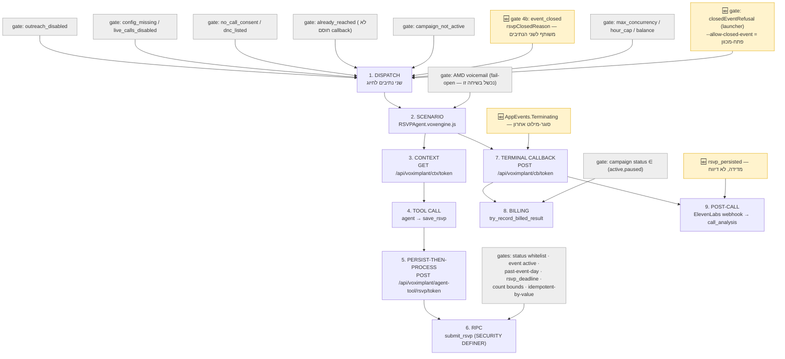

# QA לשיחת RSVP קולית — session 6904838502

## הצהרת יושר על אמצעי ההערכה

אני מודל טקסט — אינני "שומע" את השיחה. ההערכה שלהלן מבוססת על: (1) התמלול המלא מלוג הסשן של Voximplant (`/tmp/claude-10003/call.log`, `/tmp/claude-10003/transcript.txt`), (2) קוד המקור של התרחיש (`voxfiles/scenarios/src/RSVPAgent.voxengine.js`) שנקרא במלואו לצורך אימות כל טענה מול המימוש בפועל, (3) שאילתות SQL ישירות מול מסד הנתונים החי (Supabase, פרויקט מקושר) שאימתו כל שורה בטבלאות `call_attempts`, `guests`, `rsvp_responses`, `billed_results`, `call_analysis`, ופונקציית ה-RPC `try_record_billed_result`, ו-(4) הגדרת ה-TypeScript הרשמית של AMD (`typings/voxengine.d.ts`) מול קורפוס תיעוד Voximplant המקומי.

**לא סופק** קובץ אודיו או "Tier-0 acoustic pack" (מפת שתיקות/עוצמה/LUFS/קצב דיבור) לשיחה הזו. כל פרמטר שתלוי בכך מסומן במפורש `NEEDS_AUDIO` ואינו מקבל ציון בדוי. כל שאר הפרמטרים מצוטטים מול שורת לוג/תמלול/שאילתה קונקרטית — לא הערכה כללית.

## למה השיחה הזו חשובה

זו השיחה הראשונה בתולדות המוצר שבה תשובת אורח לשיחת RSVP קולית-AI **נכתבה בפועל** למסד הנתונים. שלוש שיחות גשר קודמות (למשל session 6875455354, 2026-07-20/21) קיבלו ציון 100/100 בקריטריונים הפנימיים של ElevenLabs וכתבו **אפס** RSVP-ים — כי תאריך האירוע כבר עבר ו-`submit_rsvp` סירב לכל כתיבה. הכשל היה בלתי-נראה כי כל שכבה דיווחה "בכנות" הצלחה. השיחה הנוכחית רוצה מול אירוע ייעודי עתידי (2026-07-28) כדי להוכיח את כל השרשרת מקצה לקצה — כולל, ובאותה מידה, כדי לחשוף בעיות תשתית שהציון המושלם הקודם החביא.

---

## מפת הזרימה מקצה לקצה: מהחיוג ועד RSVP שנשמר (Dispatch → Persisted RSVP)

זהו סעיף מרכזי בדוח הזה, לא נספח — התובנה שהוא חושף חשובה לפחות כמו הציון של השיחה הבודדת.

### הלקח המרכזי, במילים של הקוד עצמו

שלוש השיחות הקודמות (2026-07-21, כולל session 6875455354) עברו את **כל** שכבות השרשרת — חיוג, תרחיש, הקשר, קריאת כלי, persist-then-process, callback סופי, ניתוח-שלאחר-מעשה — **בהצלחה מלאה ובדיווח כן מכל שכבה**. הן נכשלו רק בשכבה אחת: `submit_rsvp` סירב כי יום האירוע כבר עבר. מכיוון שכל שכבה אחרת דיווחה הצלחה אמיתית (לא שיקרה — היא באמת ביצעה את מה שהיא אמורה לבצע), הכישלון בשכבה היחידה הזו היה **בלתי-נראה** מבחוץ: השיחה חויגה, האורח ענה, הסוכן שאל ואישר, ElevenLabs נתן 100/100, וה-callback הסופי חייב ורשם "הושלם" — כי "הושלם" נכון טכנית, גם כשה-RSVP לא נכתב.

הקוד עצמו מתעד את זה במילים כמעט זהות, בשתי נקודות נפרדות בשרשרת:

> `src/lib/data/outreach-calls.ts:156-161` — "Without this the whole chain still 'works' and every layer reports honestly, which is exactly what made it invisible: the dial succeeds, the agent asks the guest to confirm, save_rsvp returns a truthful `rejected`, the agent apologises — and writeReach still bills the completed call as a reached contact."

> `src/lib/voximplant/dial-preconditions.ts:63-67` — "which is how three bridge calls on 2026-07-21 were placed against a past event, scored 100/100 on their transcripts, and wrote no RSVP at all."

**המסקנה התפעולית**: שכבות "כנות" אינן מסתכמות בתוצאה נכונה. הדרך היחידה שבה זה נתפס בפועל לא הייתה קריאה מדוקדקת של אף שכבה בודדת — היא הייתה הוספת `rsvp_persisted` (מיגרציה `20260721050000`, `src/lib/data/elevenlabs-analysis.ts:69-84`): **מדידה** חיצונית לכל שרשרת הדיווח, שמשווה timestamp בפועל בטבלת `guests` מול זמן תחילת הניסיון — לא קוראת אף שדה שדיווח על עצמו הצלחה. זו הפעם הראשונה שהעמודה הזו קראה `true`.

### דיאגרמה



*(תיבות צהובות = שערים/מנגנונים חדשים מ-2026-07-21; תיבות אפורות = קיימים מקודם.)*

### הליכה שכבה-אחר-שכבה

**1. DISPATCH — תזמון החיוג.** שני נתיבים מגיעים ל-`VoxEngine.callPSTN`:
- `dispatchOutreachCall` (`src/lib/data/outreach-calls.ts:110-308`) — נתיב ה-worker. **11 שערי סירוב נפרדים**, בסדר הזה בקוד: (1) `outreach_disabled` — מתג-אב גלובלי; (2) `config_missing` — פרטי גישה חסרים; (3) `live_calls_disabled` — מתג ניהול נפרד מ-(2), כדי שמילוי פרטי-גישה לבדו לעולם לא יחייג; (4) `no_call_consent`; (5) `dnc_listed`; (6) `already_reached` — **פטור** ל-callback שהאורח עצמו ביקש (`job.isCallback`, החלטת בעלים 2026-07-21: callback הוא המשך של אותה נגיעה מחויבת, לא נגיעה שנייה — ו-`billed_results` UNIQUE(event_id,contact_id) אוכף את זה מבנית גם אם ננסה פעמיים); (7) `campaign_not_active`; (8) **🆕 `event_closed`** (gate 4b, ראו למטה); (9) `max_concurrency`; (10) `campaign_hour_cap`; (11) `balance_below_reserve` (+ `balance_check_failed` הניתן-לניסיון-חוזר בלבד). כל 11 מופיעים במפורש ב-union type `CallDispatchResult` (שורות 49-57).
- `scripts/voximplant/bridge-call.ts` — **מפעיל התפעול ששימש לשיחה הזו בפועל**. עוקף את ה-dispatcher לגמרי (מוצהר בקוד: "NOT gated on consent / DNC / balance / concurrency"). יש לו: `--confirm` חובה (בלי זה — מסרב); סירוב קשיח לכלל ה-DTMF הייצורי `1494311` (`ERROR: refusing to run against the DTMF production OutCall rule`); בדיקת ניסיון-טרמינלי + פקיעת-token (`TERMINAL_STATUSES`); ו-🆕 `closedEventRefusal` — אותו שער בדיוק, עם דלת-מילוט מוצהרת `--allow-closed-event` למי שרוצה לבדוק רק את מסלול השמע ביודעין.

שני הנתיבים שואלים כעת **אותו פרדיקט משותף בדיוק**: `rsvpClosedReason` (`src/lib/data/event-date.ts:77-93`) — משקף את שלוש דחיות הרמה-אירוע של `submit_rsvp` (`event_not_active`, `past_event_day`, `deadline_passed`) — כדי ששני הנתיבים לעולם לא יוכלו להתפצל במה ש"סגור" אומר. **זה בדיוק השער שהיה חסר** כששלושת שיחות ה-2026-07-21 בוצעו: הקמפיין הזה (draft) ממילא לא היה עובר את שער (7) ב-dispatcher, ולכן השיחה הנוכחית **חייבת** הייתה לעבור דרך `bridge-call.ts` — ואומת: `bridge-call.ts` באופן מוצהר **אינו** בודק סטטוס קמפיין ("its campaign status is deliberately NOT gated on here — an ops tool must still work against a closed campaign").

**2. SCENARIO** (`voxfiles/scenarios/src/RSVPAgent.voxengine.js`, hash מקומי `909ea19bbc53f0563dea33f959aa1fb6abad9cc40fe53343550f8010cfe9aba7`, scenarioId 918450 — `voxfiles/.voxengine-ci/scenarios/dist/RSVPAgent.metadata.config.json`). סדר: `callPSTN` → `Connected` → `record()` → **שער AMD למשיבון (fail-open — נכשל בשיחה הזו, ראו סעיף 3.1 למעלה)** → `createAgentsClient` → `conversationInitiationClientData` (dynamic_variables בלבד, נשלח כמסגרת-הלקוח **הראשונה**, לפני קישור המדיה — סדר קריטי: אחרת `{{guest_name}}` וכו' נפתרים ריקים) → `sendMediaBetween(call, agent)`. **איפה זה יכול להיכשל בשקט**: שער ה-AMD (מתועד מעל), ושלוש שכבות תצפית שקטות (VadScore, is_called/is_blocked — סעיפים 3.2-3.3).

**3. CONTEXT.** התרחיש שולף `GET {origin}/api/voximplant/ctx/{token}` (`src/app/api/voximplant/ctx/[token]/route.ts`). דורש `event.status='active'`, ניסיון לא-טרמינלי, token לא-פג — אחרת 404 גנרי (privacy-safe, כמו `/r/[token]` ו-`/g/[token]`) והסוכן רץ עם משתנים ריקים. מחזיר שדות אורח/אירוע בפורמט-דיבור (`formatIsraelSpokenDate`, `celebrantsSpeechForm`) + ה-nonce לקישור. **איפה זה נכשל בשקט**: `event_name` **לא** עובר את אותה סניטציית-דיבור (ראו ממצא ה-UX, סעיף 3.4) — כשל שקט כי אין החזרת שגיאה, רק דיבור לא-מנוקה.

**4. TOOL CALL.** הסוכן קורא ל-`save_rsvp` → נתב ה-`ClientToolCall` בתרחיש → `POST /api/voximplant/agent-tool/rsvp/{token}`.

**5. PERSIST-THEN-PROCESS** (`src/app/api/voximplant/agent-tool/rsvp/[token]/route.ts:76-111`). כותב שורת `webhook_inbox` בת-קיימא **ראשית** (דה-דופ לפי value-hash SHA-256 של `status:adults:children` — כך שתיקון-תשובה באמצע שיחה הוא שורה עצמאית משלו, בעוד שליחה-חוזרת של **אותם** ערכים היא no-op), ואז מיישם **סינכרונית** כדי שהסוכן יקבל תשובה אמיתית. מחזיר את חוזה שלושת-המצבים: `saved` (**היחיד** שמותר להשמיע כ"נרשם") | `rejected` (סופי — סירוב עסקי, אין טעם לנסות שוב) | `queued` (כשל זמני — ה-drain מנסה שוב מהשורה הבת-קיימא). השיחה הזו קיבלה `saved`. **איפה זה יכול להיכשל בשקט**: אם ה-insert ל-`webhook_inbox` עצמו נכשל — מוחזר 500 מיד (לא שקט); אבל כשל בשלב ה-apply הסינכרוני (throw) מוחזר כ-`queued` — לא נכשל בשקט כי הוא מוצהר במפורש כ"תור, ינוסה שוב", לא כ"נשמר".

**6. RPC** — `processCallRsvp` → `submitRsvp` → `submit_rsvp` (SECURITY DEFINER, אומת חי מול ה-DB). שערים לפי סדר הפונקציה עצמה: (a) status whitelist; (b) איתור+**נעילת** האורח לפי token (`for update` — הופך את בדיקת האידמפוטנטיות למוגנת-מרוץ); (c) האירוע פעיל **וגם** לא יום-שעבר (Asia/Jerusalem) **וגם** לא אחרי `rsvp_deadline`; (d) גבולות ספירה מול `expected_count`; (e) תשובות מותאמות-אישית מול `event_questions`; (f) אידמפוטנטיות-לפי-ערך מול התשובה האחרונה; (g) הוספת שורת `rsvp_responses` (append-only, ביקורת); (h) הטלה אחרונה-מנצחת על `guests` (כולל `contact_status='responded'`). **זו בדיוק השכבה שנכשלה בשלוש השיחות הקודמות** — ותאור (c) הוא בדיוק אותה בדיקה ש-`rsvpClosedReason` ו-`closedEventRefusal` משקפים כעת *לפני* החיוג, לא רק אחריו.

הערת עיצוב שכדאי לתעד: הנתיב הזה (הכלי `save_rsvp` שנקרא תוך-שיחה) הוא הנתיב **היחיד** שכותב RSVP לשיחות `rsvp_method='agent'`. ה-callback הסופי (שלב 7) שומר על ההפרדה במפורש — הענף שלו לכתיבת RSVP מותנה ב-`body.rsvp_method !== 'agent'` (`src/lib/data/call-result-processing.ts:113-118`), כדי שספירות ה-1/2 DTMF-בררת-מחדל של ה-callback לעולם לא ידרסו את הספירות האמיתיות ש-`save_rsvp` כבר כתב תוך-שיחה.

**7. TERMINAL CALLBACK.** `Disconnected` → `terminalStatus()` — כלל-מצב-סופי משותף אחד לשלושה נתיבי-סגירה (ניתוק תקין / timeout גלובלי / hangup כושל), מסודר במכוון: משיבון נבדק **ראשון** כי גם משיבון מתחיל מדיה ומדליק `conversationStarted` (`RSVPAgent.voxengine.js:253-273`) → `POST cb` → `processCallResult` → `recordCallOutcome` + `insertInteraction` + `writeReach`. בנוסף, 🆕 `AppEvents.Terminating` (`RSVPAgent.voxengine.js:310-322`) כסוגר-מילוט אחרון: VoxEngine מבטיח בקשת-HTTP אחת מותרת בתוך handler כזה — ה"חריץ" האחרון לפני שהסשן נהרס. no-op בשיחה בריאה (אידמפוטנטי דרך `state.callbackSent`); קיים בשביל שגיאת-JS-באמצע-תרחיש או סיום-כפוי של הפלטפורמה (`finish_reason='Internal error (billing timeout)'` מוכיח שזה קורה) — בדיוק המקרים שהשאירו שורות תקועות שדרשו ניקוי-ידני ב-2026-07-21.

**8. BILLING.** `writeReach` → `try_record_billed_result` (SECURITY DEFINER, אומת חי) — שער `v_status not in ('active','paused') → 'not_active'`. בשיחה הזו הקמפיין היה `draft`, ולכן 0 שורות ב-`billed_results` — **נכון**: אין לחייב קמפיין שלא אושר, גם כשה-RSVP עצמו נכתב תקין.

**9. POST-CALL.** ה-webhook של ElevenLabs → `storeCallAnalysis` (`src/lib/data/elevenlabs-analysis.ts:15-122`) → `call_analysis`. שדה 🆕 `rsvp_persisted` (מיגרציה `20260721050000_call_analysis_rsvp_persisted.sql`) הוא ה**מדידה** היחידה בטבלה כולה: משווה `guests.updated_at` מול זמן תחילת הניסיון — לא קורא שום דבר שדיווח על עצמו. נשאר `null` (לא `false`!) על כל ספק — חוסר-קישור, חוסר-אורח, או כשל קריאה — כי false-negative כאן "יאשים שיחה תקינה באובדן נתונים" (הערת קוד מפורשת). כל שאר שדות ה-`el_*` הם ElevenLabs קוראת את התמלול של עצמה.

---

## שלב 1 — הרובריקה (ננעלת לפני קריאת תוכן השיחה)

סוג שיחה: RSVP קולי אינטראקטיבי (גשר ElevenLabs, לא DTMF בלבד), אירוע פנימי לבדיקה (לא חתונה/בר-מצווה ממשי — ראו ממצא UX). המשקלים מסתכמים ל-100%.

| # | קטגוריה | משקל | הגדרה בשורה אחת |
|---|---|---|---|
| 1 | הצגה ראשונית ומניעת ניתוק | 15% | משפט פתיחה קצר וזהות דו-רכיבית (מה אני + מטעם מי) לפני השאלה הראשונה; לא נשמע כמו טלמרקטינג/IVR |
| 2 | טבעיות עברית מדוברת | 10% | פעלים בהווה, ניסוח לא-רשמי, לא "האם/בכוונתכם/נא" |
| 3 | קצב ותורות דיבור | 10% | שאלה אחת לתור, השהיה 300–400ms, ללא שתיקה מתה >2s, ללא דיבור-על-דיבור |
| 4 | השלמת המשימה — RSVP נקלט | 22% | הגעה/סירוב + מספר סועדים נקלטו, אושרו בחזרה, ונכתבו בפועל למסד |
| 5 | טיפול בכוונה וחוסן | 8% | ענה נכון לכל תשובה, ללא לולאות, ללא ניחוש שגוי |
| 6 | ציות (חוק תקשורת/ספאם ישראלי) | 10% | זהות ומטרה במשפט הראשון, ללא לחץ/אשמה, אין ניתוק על סירוב |
| 7 | טיפול בשגיאות וקצוות — כולל שער AMD/משיבון | 12% | משיבון/אדם-לא-נכון/"תתקשרו אח"כ" מטופלים בניקיון; שער ה-AMD הטרום-חיבור פועל בפועל |
| 8 | יעילות שיחה | 5% | משך כולל בטווח היעד 30–50s למסלול המאושר |
| 9 | אמינות פלטפורמה ותצפיתיות | 8% | אותות הגנה-בעומק (VadScore, is_called/is_blocked, AMD) אכן מגיעים ומספקים מידע אמיתי — לא רק "נכשל בבטחה" |

### עוגנים (2 / 6 / 10) לכל קטגוריה

1. **הצגה ראשונית**: 2 = "זוהי שיחה אוטומטית..." רובוטי / חסר זהות. 6 = זהות דו-רכיבית נכונה אך משפט ארוך/גמלוני. 10 = חם, קצר (≤8 מילים לפני שאלה), נשמע אנושי.
2. **טבעיות**: 2 = רישום כתוב/רשמי, טעויות מגדר. 6 = טבעי ברובו עם מהמור אחד. 10 = בלתי-ניתן להבחנה מאדם ידידותי.
3. **קצב**: 2 = שתיקות ארוכות/דיבור-על-דיבור בלתי-מטופל. 6 = מגיב מהר אך תור אחד גולש. 10 = תגובה מיידית, ללא חפיפה, שאלה אחת נקייה לתור.
4. **השלמת משימה**: 2 = לא נקלט RSVP כלל / הובטח בעל-פה ולא נכתב. 6 = נקלט אך ללא אישור-חוזר או עם ספק. 10 = נקלט, אושר בחזרה מול האורח, ואומת בכתיבה בפועל למסד.
5. **חוסן**: 2 = לולאת שאלות אינסופית / ניחוש שגוי. 6 = מטפל בקלט תקין, לא נבחן תחת קלט קשה. 10 = מטופל גם קלט מעורפל בכלל "שגיאה פעמיים → נפילה חכמה".
6. **ציות**: 2 = אין זהות/מטרה, לחץ על האורח. 6 = זהות ומטרה קיימות, הסרה לא נבדקה. 10 = זהות+מטרה+הסרה מיידית מכובדת בפועל.
7. **שגיאות/AMD**: 2 = שער AMD קורס/חוסם אדם אמיתי. 6 = נכשל אך בבטחה (fail-open), לא נבדק בפועל אם עוד יעבוד אי-פעם. 10 = שער AMD פעיל ומזהה נכון.
8. **יעילות**: 2 = מעל כפול מהיעד ללא סיבה. 6 = 10–30% מעל היעד. 10 = בטווח 30–50s.
9. **אמינות פלטפורמה**: 2 = אות שקט/undefined מוסתר כ"תקין", אין שום עדות בלוג. 6 = חלק מהאותות פעילים, חלק שקטים אך מתועדים. 10 = כל שלוש שכבות ההגנה-בעומק (AMD, VadScore, is_called) מספקות אות אמיתי.

---

## שלב 2 — ציון השיחה הספציפית

### ראיות מאומתות (SQL חי, 2026-07-21)

```
call_attempts: attempt_id=b1164ecb-bee0-4b4e-8c28-a101a7087f95, status=completed,
  call_duration_sec=94, rsvp_method=agent, el_conversation_id=conv_7101ky1dtng3fwk8wch7vdahr2dm
events: name="QA — בדיקת שיחה (למחיקה)", status=active, event_date=2026-07-28 14:00 UTC (17:00 IL)
campaigns: status=draft   ← קובע 'not_active' ב-try_record_billed_result, ולכן 0 billed_results (נכון)
guests: full_name="מבורך קלפה", status=attending, confirmed_adults=1, confirmed_kids=0,
  contact_status=responded, expected_count=1, updated_at=2026-07-21 04:10:56.45 UTC (אחרי תחילת השיחה)
rsvp_responses: שורה אחת, guest_id תואם, created_at=2026-07-21 04:10:56.45 UTC
billed_results: 0 שורות לניסיון הזה — נכון, כי הקמפיין 'draft' ולא 'active'/'paused'
call_analysis: el_call_score=100, call_successful=success, status=done,
  el_eval={rsvp_captured:success, headcount_correct:success, dnc_honored:success, stayed_on_task:success},
  el_data={status:attending, adults:1, children:0}, agent_turns=13, user_turns=10,
  termination_reason="end_call tool was called.", rsvp_persisted=TRUE
```

`rsvp_persisted` נוסף במיגרציה `20260721050000_call_analysis_rsvp_persisted.sql` — נוצר באותו יום כדי לתפוס בדיוק את מקרה ה-"100/100 אך אפס RSVP" מהשיחות הקודמות. זו הפעם הראשונה שהעמודה קוראת `true`.

### טבלת ציונים

| # | קטגוריה | משקל | ציון /10 | עוגן שהתאים | ראיה |
|---|---|---|---|---|---|
| 1 | הצגה ראשונית | 15% | 7 | בין 6 ל-10 | תור 1 (T+0:03) כולל את שני הרכיבים ("מאושר, עוזר קולי אוטומטי" + "מטעם בעלי השמחה") — עומד בכלל שעודכן ב-2026-07-20. אך המשפט ארוך בהרבה מ-8 מילים, מסתיים בהיגד לא בשאלה, וכולל את שם האירוע הגולמי. תגובת האורח "היי, ג'נלו" (T+0:14) נשמעת כמו אי-הבנה, והסוכן חוזר על הצגה כמעט זהה בתור 3 (T+0:16) — כפילות שעולה זמן |
| 2 | טבעיות עברית | 10% | 8 | 10 | "יופי. אז מגיעים?" / "סבבה, אז רק אתה..." — משלב מדובר, לא רשמי, ללא "האם/נא". ניכוי קל על "כאן מאושר" הנוקשה בפתיחה. פרוזודיה/גוון קול — `NEEDS_AUDIO` |
| 3 | קצב ותורות | 10% | 8 | 10 | זמני תגובה נמדדו מהלוג: 0.03–0.75s ברוב התורות (טוב מאוד), אירוע Interruption+AgentResponseCorrection אחד (04:09:36, ~T+0:05) בזמן המשפט הארוך של תור 1 — קוד `clearMediaBuffer()` טיפל בו נכון (RSVPAgent.voxengine.js:719-741), אך זו עדות ישירה שהפתיחה הארוכה גרמה לחפיפת דיבור אמיתית |
| 4 | השלמת משימה — RSVP | 22% | 10 | 10 | attending/adults=1/kids=0 נקלטו, אושרו בחזרה מול האורח ("רשמתי אחד מבוגר וללא ילדים, נכון?" → "כן, נכון"), `save_rsvp -> 200 ok=true status=saved` בלוג, ואומת ישירות ב-DB: `guests.status='attending'`, `rsvp_responses` שורה חדשה, `rsvp_persisted=true`. הסוכן לא הכריז הצלחה לפני קבלת 'saved' בפועל |
| 5 | חוסן/כוונה | 8% | 7 | 6 | כל תשובות האורח היו שיתופיות וישירות — המסלול הפשוט טופל נקי. לא נבחן קלט מעורפל, DTMF, או כלל "שגיאה פעמיים" — **לא ציון כישלון, אלא היקף לא-נבדק** |
| 6 | ציות | 10% | 8 | 6-10 | זהות+מטרה במשפט הראשון — כן. לחץ/אשמה על סירוב — לא נצפה (לא רלוונטי, האורח אישר הגעה). מסלול הסרה/DNC לא הופעל בשיחה זו — **לא נבדק, לא נכשל** |
| 7 | שגיאות/AMD | 12% | 6 | 6 (fail-open בטוח, לא פעיל) | ראו ניתוח מעמיק בסעיף 3 למטה. שער ה-AMD כשל ב-100% מהמקרים שנצפו (detect_error מיידי), נופל פתוח בבטחה (אדם אמיתי מעולם לא נחסם) — אך שכבת ההגנה הראשונה אינה פעילה בפועל כרגע |
| 8 | יעילות | 5% | 4 | 2-6 | משך כולל 94s מול יעד 30–50s (כ-88%–213% מעל). כ-28 מהשניות (עד T+0:29, השאלה המהותית הראשונה) הושקעו בהצגה עצמה ובחזרה עליה |
| 9 | אמינות פלטפורמה | 8% | 3 | 2 | שלוש שכבות הגנה-בעומק (AMD, VadScore, is_called/is_blocked) — אף אחת לא סיפקה אות אמיתי בשיחה זו; כולן נופלות לענף הבטוח-כברירת-מחדל. ראו סעיף 3 |

**סה"כ משוקלל: 15%×7 + 10%×8 + 10%×8 + 22%×10 + 8%×7 + 10%×8 + 12%×6 + 5%×4 + 8%×3 = 73.7 ≈ 74/100**

### פסיקה

**74/100 — תקין עם פערים משמעותיים בשכבת האמינות/התצפיתיות; שכבת לכידת ה-RSVP עצמה מושלמת (10/10).**

זו לא סתירה: המשימה שהשיחה נועדה לבדוק — שתשובת אורח אכן תיכתב למסד — הצליחה במלואה ומאומתת. אבל שלוש מנגנוני הגנה-בעומק שאמורים להגן על העלות והאמינות של הערוץ (AMD, VadScore, is_called) כולם שקטים או שבורים בפועל, וכיסוי ה-QA שבוצע כאן לא כלל מסלול קשה (DTMF, קלט מעורפל, הסרה). ציון 100/100 מ-ElevenLabs על השיחה הזו עצמה **כן** תואם למציאות (בניגוד לשיחות הקודמות) — אבל רק כי כל התנאים הנדרשים (קמפיין future-dated, אורח אמיתי, לא משיבון) הצטלבו הפעם. אין להסיק מכך שהמנגנונים שנכשלו כאן "לא משנה" — הם ייכשלו שוב באותה צורה בשיחה הבאה, רק שהפעם עלולה להיות שיחה למשיבון אמיתי.

---

## התמלול (מנוקה, עברית, T+ מרגע Call.Connected בשעה 04:09:31.274 UTC)

| T+ | דובר | טקסט |
|---|---|---|
| 0:03 | סוכן | היי, מבורך? … כאן מאושר, עוזר קולי אוטומטי מטעם בעלי השמחה — בנוגע לQA — בדיקת שיחה (למחיקה). |
| 0:14 | אורח | היי, ג'נלו. |
| 0:16 | סוכן | היי! אני מאושר, עוזר קולי אוטומטי מטעם נטלי קלפה - זה בנוגע לQA — בדיקת שיחה (למחיקה). חצי דקה וסיימנו, בסדר? |
| 0:28 | אורח | אוקיי, בסדר גמור. |
| 0:29 | סוכן | מעולה. אז בקשר לQA — בדיקת שיחה (למחיקה) - אתה מבורך? |
| 0:40 | אורח | . כן. |
| 0:40 | סוכן | יופי. אז מגיעים? |
| 0:51 | אורח | כן. |
| 0:51 | סוכן | מעולה. כמה מבוגרים? |
| 1:01 | אורח | אחת כל מבוגר, אחד ללא ילדים. |
| 1:02 | סוכן | סבבה, אז רק אתה - זה אחד מבוגר. וילדים, יש? |
| 1:10 | אורח | לא. |
| 1:10 | סוכן | מושלם. אז רשמתי אחד מבוגר וללא ילדים, נכון? |
| 1:24 | אורח | כן, נכון. |
| 1:24 | סוכן | שנייה, אני מעדכן... *(`save_rsvp` — 200, saved, 1.78s)* |
| 1:28 | סוכן | מעולה, זה נרשם אצלנו במערכת. יום נהדר! |
| 1:32 | — | `end_call` נקרא, WebSocket נסגר |
| 1:34 | — | ניתוק שיחה, משך כולל 94s |

הערה: השהיה בולטת של 14 שניות בין תור 1:10 (סוכן) לתור 1:24 (אורח) — האורח לקח זמן להשיב "כן, נכון" לשאלת האישור-חוזר. זו השהיה מצד האורח, לא dead-air שנגרם ע"י הסוכן, ואינה נזקפת נגד קטגוריה 3.

---

## שלב 3 — שלוש האנומליות (הניתוח המרכזי של הדוח הזה)

### 3.1 שער AMD: `detect_error → bridging`

מהלוג (RSVPAgent.voxengine.js:507-506 מיושם, שורות 24-27 בלוג):
```
04:09:31.275  AMD.Events.DetectionError  message: "The 'call' parameter is required, the operation will be skipped!"
04:09:31.275  [RSVPAgent] AMD detect error: ... — failing open
04:09:31.275  [RSVPAgent] AMD gate: detect_error → bridging
```
השגיאה הגיעה **באותה מילישנייה** שבה `call.sendMediaTo(amd)` בוצע (שורה 23 בלוג, גם 04:09:31.275) — כלומר `amd.detect()` (RSVPAgent.voxengine.js:493) נקרא באופן סינכרוני מיד אחרי `call.sendMediaTo(amd)`, בלי לחכות לאישור מהפלטפורמה שניתוב המדיה לגלאי אכן הושלם. זה תבנית race condition קלאסית: הקוד לא ממתין לאף אירוע ("המדיה חוברה") לפני שהוא קורא ל-`detect()`.

חשוב: `typings/voxengine.d.ts` (שורות 1112-1129, `AMD.Parameters`) **לא מכיל שדה `call` כלל** — רק `model`, `timeout`, `thresholds` — וקורפוס התיעוד המקומי (`docs/voximplant/research/vox-ref-callflow.md:29`) מתאר את אותו API בדיוק: `AMD.create(parameters) → detector`, מדיה מחוברת בנפרד דרך `sendMediaTo`. כלומר **הקוד תואם במדויק את ה-API המתועד** — השגיאה בזמן ריצה ("'call' parameter is required") סותרת את החוזה המתועד. ל־class יש שדה `readonly call?: Call` (שורה 940) שמרמז שהפלטפורמה בפועל מצפה לקישור פנימי בין הגלאי לשיחה לפני `detect()`, קישור שכנראה עדיין לא הושלם באותה מילישנייה.

**מסקנה משיקה מהלוג (לא ודאות מוחלטת)**: זה נראה כמו תנאי-מרוץ תזמון, לא בעיית קונפיגורציה — `sendMediaTo` ו-`detect()` נקראים בלי המתנה לאירוע ביניים. יש לוודא זאת מול המדריך החי של Voximplant (לא רק מול ה-`.d.ts` המקומי) לפני כתיבת תיקון.

**המשמעות התפעולית**: התגובה בקוד ("failing open") היא **ההחלטה הנכונה** — אדם אמיתי מעולם לא נחסם עקב זה. אבל כרגע, **שכבת ההגנה הראשונה נגד משיבונים בפועל אינה פועלת בכלל** (לא "לא מדויקת" — לא רצה בכלל). ההערה בקוד עצמו (RSVPAgent.voxengine.js:147-149) כבר מתעדת שהיה צפוי כישלון-דיוק על +972 (אין מודל עברית), אבל הכישלון שנצפה כאן הוא סוג שונה ויסודי יותר — לא כישלון-דיוק, כישלון-הרצה. `voicemail_detection` של ElevenLabs (הותקן 2026-07-20 בדיוק בגלל התלות הזו — ראו RSVPAgent.voxengine.js:852-858) הוא כעת שכבת ההגנה **היחידה** בפועל.

### 3.2 `maxVadScore=0` חרף שיחה דו-כיוונית אמיתית

הקוד (RSVPAgent.voxengine.js:820-830) עוקב אחרי `ElevenLabs.AgentsEvents.VadScore` ורושם את ה-high-water-mark. בלוג הסשן זה נדפס פעם אחת, בסיום: `[RSVPAgent] maxVadScore=0`.

הראיה המכרעת נמצאת **בלוג ההעברה הגולמי (raw WebSocket.Message)**: כל סוג אירוע אחר שהסוכן שולח — `AgentResponse`, `UserTranscript`, `Ping`, `Interruption`, `AgentResponseCorrection`, `ConnectorInformation`, `ConversationInitiationMetadata`, `ClientToolCall`, `AgentToolResponse` — **מופיע** בלוג כ-`WebSocket.Message` נפרד עם `customEvent` מזוהה. `VadScore` **לא מופיע אף פעם** באותו לוג גולמי, לא פעם אחת, לאורך כל 94 השניות — למרות תמלול נכון ועקבי של דיבור האורח (מה שמוכיח שצינור ה-ASR של ElevenLabs קיבל אודיו אמיתי וברור).

**מסקנה משיקה מהלוג**: זה לא באג-פירסור בקצה שלנו (למשל `payload.vad_score_event` שגוי) — זו עדות שהאירוע **בכלל לא נשלח** על הקשר הזה (connector v0.57.4, endpoint `/elevenlabs`), ולא שהוא הגיע עם ערך 0 אמיתי. אילו הגיע ולו פעם אחת עם ניקוד אמיתי >0 (כפי שצריך לקרות באופן שגרתי במהלך דיבור), ה-max לא היה נשאר 0. האות פשוט לא זמין דרך הגשר הזה כרגע — לא "נמוך", אלא נעדר. זה חמור יותר מציון-אפס גלוי כי הוא **נראה** כמו קריאה תקינה במקום שגיאה בולטת.

### 3.3 `is_called`/`is_blocked` מגיעים כ-`undefined`

מהלוג (RSVPAgent.voxengine.js:859-887, שורות 220 ו-236 בלוג):
```
AGENT_TOOL_RESPONSE: save_rsvp type=? is_error=false is_called=undefined is_blocked=undefined
AGENT_TOOL_RESPONSE: end_call   type=? is_error=false is_called=undefined is_blocked=undefined
```
לפי ה-AsyncAPI של ElevenLabs, `is_called` הוא שדה **חובה** על ההודעה הזו — אך הקונקטור (v0.57.4) לא ממלא אותו כאן, לא עבור כלי-לקוח (`save_rsvp`) ולא עבור כלי-מערכת (`end_call`).

הטיפול בקוד (שורה 875): `var executed = atr.is_called !== false && atr.is_blocked !== true;` — כלומר **היעדר השדה נחשב "בוצע"**. זו ההחלטה הנכונה, ומתועדת ככזו בהערת הקוד עצמה (שורות 864-874): הדרישה ל-`=== true` הייתה משביתה בשקט את זיהוי-המשיבון (`voicemail_detection`) בכל שיחה שבה השדה לא מגיע — טעות שהייתה **מפחיתה** חיוב על שיחות אמיתיות שנענו (המכניזם שאמור לחסוך כסף פשוט לא היה פועל אף פעם).

אבל המשמעות ההפוכה נכונה באותה מידה: **מגן-הבטיחות הזה כרגע לא מגן על כלום**. הוא לא יכול לעולם לחסום סיווג-מחדש-כמשיבון כי השדה שאמור לאפשר לו לחסום (`is_called===false`) פשוט לא מגיע. שני הכלים היחידים שנבדקו בשיחה זו (`save_rsvp`, `end_call`) — שניהם כלי-לקוח/מערכת שרצו בהצלחה בפועל — מציגים את אותה בעיה, כך שזה נראה כמו מאפיין עקבי של הקונקטור בגרסה הזו, לא אירוע חד-פעמי.

**דפוס משותף לשלוש האנומליות**: כל שלושתן הן שכבות הגנה-בעומק שאמורות לתת אות אמיתי, וכולן מתכנסות בשקט ל"תמיד בטוח" (fail-open / executed=true כברירת מחדל) — מה שמונע נזק בשיחה הזו, אבל אומר ששום דבר לא באמת מגן על העלות/האמינות של הערוץ כרגע. שלושתן ראויות למעקב הנדסי מיידי, לא רק לתיעוד.

---

## שלב 3.4 — ממצא UX: שם האירוע הגולמי מוקרא פעמיים-שלוש

הסוכן הקריא את המחרוזת הגולמית **"QA — בדיקת שיחה (למחיקה)"** מילה במילה, **שלוש פעמים** (T+0:03, T+0:16, T+0:29) — כולל את ראשי התיבות הלועזיים "QA" ואת ההערה הפנימית "(למחיקה)" (=מיועד למחיקה), שהוקלדה ע"י מי שיצר את אירוע הבדיקה כתזכורת לעצמו, לא כטקסט לאוזני אורח.

מקור: `src/app/api/voximplant/ctx/[token]/route.ts:89` — `event_name: ctx.event.name ?? ''` — **ללא כל סניטציה**. זהו בדיוק אותו דפוס באג שכבר תוקן, אבל **רק** עבור שדה שם-בעלי-השמחה (`celebrantsSpeechForm`, אותו קובץ שורות 33-42): שם עם מקף-רחב ("—") גרם לעיוות דיבור בשיחה חיה קודמת (session 6875455354, "נטלי קלפה — לכבוד בני" נשמע כ"נטליקה" — מתועד בהערת קוד שם). התיקון ההוא הוגבל ל-`event_celebrants` בלבד; `event_name` נשאר גולמי לחלוטין.

**חומרה בפועל בשיחה הזו**: נמוכה — "מבורך קלפה" הוא כנראה איש צוות פנימי (שם המשפחה תואם לבעלים), ו-`updated_at`/ההקשר מצביעים על אירוע-בדיקה מכוון. אבל זהו באג מערכתי, לא ספציפי-לשיחה: **כל** שם אירוע חופשי שבעל אירוע מקליד — כולל מקפים, ראשי תיבות באנגלית, סוגריים, אימוג'ים — יוקרא מילה-במילה לאורח אמיתי. אין שום מנגנון היום שמונע משם-אירוע "לא-לדיבור" (כמו זה) להגיע לשיחה עם אורח אמיתי.

---

## שלב 4 — המלצות מדורגות

### לתקן עכשיו (Fix now)

1. **שם אירוע גולמי מוקרא לאורח** (משקל 15%, פער 3/10 → 4.5 נק' פוטנציאליים) — להחיל על `event_name` את אותו טיפול שכבר קיים עבור celebrants ב-`src/app/api/voximplant/ctx/[token]/route.ts`: להוסיף פונקציית `eventNameSpeechForm` שמפצלת/מנקה מקפים, ולחסום/להתריע כשהשם מכיל תבניות לא-לדיבור מובהקות (למשל "(למחיקה)", "TEST", "QA"). אחראי: `voice-rsvp-agent` (טקסט/פורמט) עם `voximplant-engineer` (הקוד ב-route.ts).
2. **שער ה-AMD לא רץ בפועל (100% detect_error)** (משקל 12%, פער 4/10 → 4.8 נק' פוטנציאליים) — לבדוק אם `amd.detect()` נקרא לפני שהמדיה חוברה בפועל (RSVPAgent.voxengine.js:484-493); לאמת מול מדריך Voximplant החי (לא רק typings מקומיים) האם צריך להמתין לאירוע לפני `detect()`. אחראי: `voximplant-engineer`.
3. **משך שיחה 94s מול יעד 30–50s** (משקל 5%, פער 6/10 → 3.0 נק' פוטנציאליים) — נובע ברובו מסעיף 1: הפתיחה הכפולה/הארוכה תופסת כ-29 מ-94 השניות. תיקון סעיף 1 (בעיקר קיצור הפתיחה ל-≤8 מילים+שאלה) צפוי לפתור את רוב הפער כאן בלי שינוי נפרד. אחראי: `voice-rsvp-agent`.

### לעקוב (Watch — לא לפעול עיוור)

- **`maxVadScore=0`** — אין ראיה בלוג שהאירוע בכלל נשלח (לא רק פורש שגוי). לפני שינוי קוד: לוודא מול תמיכת ElevenLabs/Voximplant האם קונקטור v0.57.4 אמור לשדר `VadScore` על גשר טלפוניה מסוג זה.
- **`is_called`/`is_blocked` = undefined** — ההתנהגות הנוכחית (היעדר=בוצע) היא הבחירה הבטוחה ונכונה; אין לשנות אותה בלי אישור שהשדה אכן ממולא בגרסת קונקטור עתידית. לעקוב אחרי גרסאות קונקטור הבאות ולבדוק אם השדה מתחיל להגיע.
- **מסלולי ציות/חוסן לא נבדקו** — הסרה/DNC, קלט מעורפל, DTMF, ו-2-strike לא הופעלו בשיחה הזו כי האורח שיתף פעולה לכל אורך הדרך. נדרשת שיחת QA נוספת עם מסלול קשה יותר לפני שניתן לתת ציון מלא לקטגוריות 5 ו-6.

---

## נספח — מקורות גולמיים

- לוג סשן Voximplant: `/tmp/claude-10003/call.log` (256 שורות, verified)
- תמלול נקי: `/tmp/claude-10003/transcript.txt`
- קוד תרחיש: `voxfiles/scenarios/src/RSVPAgent.voxengine.js`
- נתיב הקשר לשיחה: `src/app/api/voximplant/ctx/[token]/route.ts`
- טיפוסי AMD: `typings/voxengine.d.ts:933-1130`
- קורפוס תיעוד Voximplant: `docs/voximplant/research/vox-ref-callflow.md`
- מיגרציית `rsvp_persisted`: `supabase/migrations/20260721050000_call_analysis_rsvp_persisted.sql`
- פונקציית RPC: `public.try_record_billed_result` (אומתה חיה מול DB, 2026-07-21)
- טבלאות DB שנבדקו חיה: `call_attempts`, `events`, `campaigns`, `guests`, `rsvp_responses`, `billed_results`, `call_analysis`
