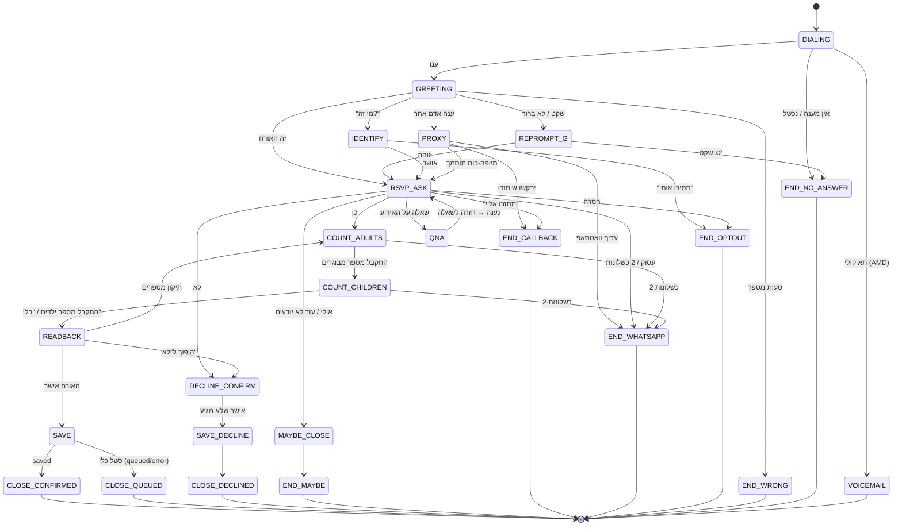

# KALFA — Conversation Design: שיחות RSVP קוליות

**מטרה:** מנוע ה-RSVP הקולי הטוב ביותר בעברית.
**סטטוס:** מסמך תכנון (Source of Truth). ממנו ייגזרו: הוראות (Instructions) לסוכן ElevenLabs, חוזי כלי ה-webhook, ולוגיקת התרחיש ב-Voximplant. המסמך **אינו** ה-prompt עצמו ואינו נוגע בסוכן החי.
**עדכון אחרון:** 2026-07-15.

---

## 0. עוגני מערכת מאומתים (אין לסתור)

עובדות שאומתו בקוד ובשיחות חיות. כל שינוי בהן מחייב עדכון מסמך זה.

| # | עובדה | מקור אימות |
|---|---|---|
| E-1 | הארכיטקטורה: Voximplant מגשר PSTN → סוכן ElevenLabs Conversational (`eleven_v3_conversational`, קול Kalfa, שפה he). | `voxfiles/scenarios/src/VoiceAgentTest.voxengine.js` |
| E-2 | משתנים דינמיים פר-שיחה: `{{guest_name}}`, `{{event_name}}`, `{{event_date}}`, `{{event_venue}}` — מוזרקים כ-frame ראשון (`conversation_initiation_client_data`) מתוך `GET {u}/api/voximplant/ctx/{tok}`. | אותו קובץ, שורות 205–223 |
| E-3 | ניקוד בשם האורח משפר הגייה (הוכח חי: זְהָבָה תוקן מ"זה אבא"). השמות יגיעו **מנוקדים** משכבת ה-ctx. | NIQQUD_TEST_MAP בתרחיש + שיחת אימות |
| E-4 | כלי `save_rsvp` קיים ופרוס: `{attending: boolean, adults: int, children: int}` → נכתב ל-KALFA דרך `submit_rsvp` (endpoint token-scoped: `POST /api/voximplant/agent-tool/rsvp/{token}`). הסוכן רשאי לומר "נרשם" **רק** אחרי תוצאת `saved`. | `src/lib/validation/voximplant.ts` (voxSaveRsvpSchema), `plans/voximplant-tier2-save-rsvp-plan.md` |
| E-5 | תגיות רגש בסוגריים מרובעים (v3 audio tags) **אסורות** בכל טקסט של הסוכן — הן דולפות לתמלול ונאמרות בקול. | אומת חי |
| E-6 | חולשת turn-taking אמיתית: תשובות בנות מילה אחת ("אחד") עלולות ללכת לאיבוד. העיצוב חייב שאלות שמזמינות תשובות מעט ארוכות יותר + נוסח fallback לשקט. | אומת חי |
| E-7 | סטטוסי RSVP במערכת: `attending` / `declined` / `maybe` בלבד (`RSVP_STATUSES`, `src/lib/constants.ts:53`). `submit_rsvp` תומך בשלושתם; כלי `save_rsvp` הנוכחי מבטא רק attending/declined. | `src/lib/whatsapp/rsvp-buttons.ts`, `src/lib/data/rsvp.ts` |
| E-8 | DNC: טבלת `call_dnc_list` קיימת (מפתח = טלפון מנורמל E.164); ה-dispatcher מדלג עליה (`isDncListed`, outreach-engine). הוספה כיום — ממשק אדמין בלבד; **אין** כלי בזמן-שיחה. | `src/lib/data/admin/call-dnc.ts` |
| E-9 | Consent: שדה `contacts.call_consent_at` (חשוף כ-`call_consent` ב-RSVP view). שיחות חיות חסומות עד השלמת מסלול B1. | `src/lib/data/rsvp.ts:70-77`, memory B1 |
| E-10 | שעות חיוג מותרות 08:00–21:00 שעון ישראל — נאכפות בשכבת ה-dispatch; התרחיש מוסיף safety-net. | כלל מוצר קבוע |
| E-11 | הסוכן ההופכי (scenario) מדווח תוצאות שיחה (cb) ומטפל ב-`ClientToolCall`; timeout גלובלי סוגר סשן. | VoiceAgentTest.voxengine.js |

---

# שכבה 1 — תכנון עסקי

## 1.1 מטרת השיחה

לאסוף אישור הגעה מלא מהאורח הנכון, בשיחה קצרה (יעד 30–90 שניות), בחוויה שמרגישה כמו שליחות אישית מטעם בעלי האירוע — לא טלמרקטינג. כל שיחה חייבת להסתיים בתוצאה מדווחת (גם "לא ענה" הוא נתון).

## 1.2 נתוני חובה לאיסוף

| נתון | חובה? | הערות |
|---|---|---|
| אימות שמדברים עם האורח הנכון (או מיופה-כוח מובהק) | חובה לפני כל שמירה | אין שמירת RSVP על סמך צד ג' לא-מוסמך (ילד, שכן) |
| הגעה: כן / לא / אולי | חובה | "אולי" הוא תשובה לגיטימית — לא לוחצים |
| מספר מבוגרים | חובה כשמגיעים | שאלה נפרדת מהילדים |
| מספר ילדים | חובה כשמגיעים | ברירת מחדל 0 אם נאמר במפורש "בלי ילדים" / "רק מבוגרים" |
| אישור read-back של המספרים | חובה לפני `save_rsvp` | הסוכן חוזר על הסיכום והאורח מאשר |

נתוני רשות (נאספים אם עולים, לא נשאלים יזומות): הערה חופשית (למשל נגישות) — [דורש כלי חדש: העברת הערה], העדפת מנה — [החלטת מוצר: האם לשאול בשיחה כש-`show_meal_pref` פעיל].

## 1.3 מצבי סיום מותרים (Terminal Outcomes)

שיחה מותר לסיים **רק** באחד מהמצבים הבאים, וכל אחד מדווח למערכת:

| תוצאה | מתי | פעולת מערכת |
|---|---|---|
| `confirmed` | האורח אישר הגעה + מספרים + read-back, `save_rsvp` החזיר saved | RSVP נכתב (attending + counts) |
| `declined` | האורח סירב במפורש | `save_rsvp` עם attending=false |
| `maybe` | "אולי / עוד לא החלטנו" | [דורש כלי חדש] הרחבת save_rsvp לסטטוס maybe (ר' 4.2) |
| `callback_requested` | האורח ביקש שיחזרו אליו | [דורש כלי חדש] `schedule_callback` |
| `whatsapp_fallback` | האורח מעדיף וואטסאפ / 2 כשלונות הבנה | דיווח outcome; שליחת וואטסאפ ב-dispatcher |
| `opt_out` | "תסירו אותי" וכל ניסוח שקול | [דורש כלי חדש] `mark_dnc` (ר' 4.2); עד אז — דיווח outcome ייעודי + הוספה ידנית |
| `wrong_number` | לא האדם הנכון והמספר שגוי | דיווח; המערכת מסמנת לבדיקת פרטי קשר |
| `voicemail` / `no_answer` / `failed` | ברמת ה-scenario, לא ברמת הסוכן | cb קיים |
| `abandoned` | ניתוק יזום של האורח לפני תוצאה | דיווח; retry policy ב-dispatcher |

**אסור לסיים שיחה:** בלי דיווח תוצאה; באמצע read-back בלי לנסות סגירה מנומסת; אחרי אישור מילולי בלי קריאת `save_rsvp`.

## 1.4 מתי חובה "העברה" (Escalation)

אין כיום העברה חיה לנציג אנושי — [דורש כלי חדש: `transfer_to_human`] וגם [החלטת מוצר: האם בכלל יהיה יעד אנושי — נציג KALFA או בעל האירוע]. עד אז, ה"העברה" המחייבת היא **מסירת הודעה לבעל האירוע / מעבר לערוץ אחר**, בתרחישים אלה:

1. האורח מבקש במפורש לדבר עם בן-אדם / עם בעל האירוע.
2. שאלה שהסוכן אינו יודע לענות עליה מנתוני ה-ctx (מתנות, קוד לבוש, שינויים באירוע) — הסוכן לעולם לא ממציא.
3. נושא רגיש (אבל, מחלה, סכסוך משפחתי) — סגירה אמפתית, בלי שמירת RSVP, סימון לטיפול אנושי.
4. חשד להונאה מצד האורח — הפניה לערוץ מאומת (וואטסאפ מהמספר המוכר / קישור RSVP).

## 1.5 כללי חוק ואתיקה (מחייבים, לא ניתנים לעקיפה)

1. **הזדהות מיידית:** במשפט הראשון או מיד כשנשאלים — מי מתקשר, מטעם מי, ולמה. כשנשאלים "זה רובוט?" — הודאה מפורשת: "כן, אני עוזרת קולית אוטומטית מטעם {בעלי האירוע}". אסור להתחזות לאדם.
2. **הסרה מיידית:** כל ניסוח של "תסירו אותי / אל תתקשרו / די להציק" → אישור ההסרה, התנצלות קצרה, סיום. בלי ניסיון שכנוע, בלי "רק שאלה אחת". התוצאה חייבת להגיע ל-DNC (`call_dnc_list`).
3. **שעות שקטות:** אין חיוג לפני 08:00 ואחרי 21:00 שעון ישראל (אכיפה ב-dispatcher; safety-net בתרחיש). [החלטת מוצר: החרגת ימי שישי אחה"צ / שבת / חגים — מומלץ לחסום].
4. **ללא שיווק:** השיחה עוסקת אך ורק באישור הגעה לאירוע שהאורח הוזמן אליו. אסור upsell, אסור אזכור KALFA כמוצר, אסור איסוף מידע מעבר לנדרש.
5. **פרטיות:** אין למסור פרטי אירוע (מקום, תאריך) לפני שווידאנו שמדברים עם האורח או בן-משפחה מזוהה. אין למסור טלפון של בעל האירוע. אין לחשוף מי עוד מוזמן.
6. **קטינים:** אם ברור שעונה ילד — לא מנהלים איתו את השיחה; מבקשים מבוגר או מסיימים בנימוס.
7. **Consent:** שיחה יוצאת רק לאורח עם `call_consent` רשום (מסלול B1 — חוסם עלייה לאוויר).
8. **כבוד לתשובה:** "לא" הוא לא. אין guilt-trip, אין "בטוח?", אין ניסיון היפוך.

---

# שכבה 2 — Conversation Design

## 2.1 עקרונות ניסוח (עברית מדוברת)

- **כלל 3 השניות:** משפט הפתיחה מכיל שם האורח → שם בעלי האירוע/האירוע. שום דבר תאגידי לפני זה.
- משפטים קצרים, הווה, בלי "האם", בלי "בכוונתכם", בלי "נא לאשר". "מגיעים?" ולא "האם בכוונתכם להגיע?".
- שאלה אחת בכל תור. אישורים של 2–4 מילים ("מעולה, רשמתי").
- **בגלל E-6 (turn-taking):** שאלות מנוסחות כך שיזמינו תשובה של כמה מילים — "כמה מבוגרים תהיו?" עדיף על "כמה?"; ואחרי שקט קצר: "סליחה, לא קלטתי — כמה מבוגרים יגיעו?".
- Re-prompt לעולם לא חוזר מילה במילה — תמיד ניסוח מחודש. מקסימום 2 כשלונות לשאלה → נתיב וואטסאפ.
- **בגלל E-5:** אסור שום `[tag]` בטקסט. רגש מובע במילים ובניסוח בלבד.
- מספרים נאמרים במילים ("ארבעה", לא "4"). שמות מגיעים מנוקדים (E-3).
- אין חפירות: סך דיבור הסוכן בתור ≤ 2 משפטים.

## 2.2 מכונת המצבים



**סדר האיסוף קבוע:** הגעה → מבוגרים → ילדים → read-back → `save_rsvp` → סגירה. תיקון בכל שלב מחזיר לשלב הרלוונטי, לא מתחיל מהתחלה.

## 2.3 נוסחי ליבה לכל מצב (התסריט הקנוני)

משתנים: `{{guest_name}}` (מנוקד), `{{event_name}}` (למשל "החתונה של נועה ואיתי"), `{{event_date}}`, `{{event_venue}}`.

| מצב | נוסח קנוני | הערות |
|---|---|---|
| GREETING | "היי, זו שיחה קצרה לגבי אישורי הגעה — מדברת עם {{guest_name}}?" | תכלית בלי פרטי אירוע (לקח 6758867554); המתנה לתשובה |
| IDENTIFY | "אני אשמח לעדכן — אני מתקשרת מטעם {{event_name}}, לגבי אישורי ההגעה. מדברת עם {{guest_name}}?" | הזדהות מלאה כשנשאלים |
| RSVP_ASK | "מעולה! מתקשרת בשם {{event_name}} שיהיה {{event_date}} — רציתי לבדוק, אתם מגיעים?" | האירוע + התאריך במשפט אחד |
| COUNT_ADULTS | "איזה כיף! כמה מבוגרים תהיו?" | "מבוגרים" מפורש — מפריד מילדים |
| COUNT_CHILDREN | "ומגיעים גם ילדים? כמה?" | שאלה שמזמינה תשובה מלאה (E-6) |
| READBACK | "אז רק לוודא שרשמתי נכון — {מבוגרים} מבוגרים ו{ילדים} ילדים, נכון?" | חובה לפני save_rsvp |
| CLOSE_CONFIRMED | "מצוין, אישור ההגעה נרשם. נתראה באירוע, יום נהדר!" | רק אחרי result=saved |
| CLOSE_QUEUED | "רשמתי, אנחנו נעדכן במערכת. תודה רבה ויום טוב!" | כשהכלי נכשל — בלי להבטיח "נשמר" |
| DECLINE_CONFIRM | "אין שום בעיה, אני מעדכנת שלא תגיעו. שיהיה יום נעים!" | בלי לחץ, בלי "בטוח?" |
| MAYBE_CLOSE | "בסדר גמור, לא צריך להחליט עכשיו. נשלח לכם תזכורת בוואטסאפ בעוד כמה ימים, טוב? יום טוב!" | |
| WHATSAPP_FALLBACK | "אין בעיה — אשלח לך הודעת וואטסאפ ותוכלו לענות מתי שנוח. יום נהדר!" | נתיב היציאה האוניברסלי |
| OPT_OUT | "כמובן, הסרתי אותך מרשימת השיחות. סליחה על ההפרעה, יום טוב." | מיידי, בלי שאלות המשך |
| VOICEMAIL | "היי {{guest_name}}, מתקשרים מטעם {{event_name}}. נשלח לך הודעת וואטסאפ לאישור הגעה. תודה!" | קצר; בלי לבקש חיוג חוזר |

**בנק re-prompt** (לסבב שני, לעולם לא זהה לראשון):
- להגעה: "רק לוודא — תגיעו לאירוע?"
- למבוגרים: "סליחה, לא קלטתי — כמה מבוגרים יגיעו?"
- לילדים: "לא שמעתי טוב — כמה ילדים יהיו איתכם?"
- כללי לרעש: "קצת קשה לי לשמוע — אפשר לחזור על זה?"

## 2.4 קטלוג תרחישים

מבנה כל שורה: **טריגר** (מה האורח אמר/קרה) → **תגובה** (הנוסח המדויק) → **מצב יעד** → **פעולת מערכת**.
פעולות: `save_rsvp` · `outcome:<x>` (דיווח תוצאה) · `—` (המשך שיחה) · `[דורש כלי חדש]`.

### א. פתיחה, זיהוי ומענה של אדם אחר (S-001 – S-014)

| מזהה | טריגר | תגובה (נוסח מדויק) | מצב יעד | פעולת מערכת |
|---|---|---|---|---|
| S-001 | "כן, מדבר/ת" | "מעולה! מתקשרת בשם {{event_name}} שיהיה {{event_date}} — רציתי לבדוק, אתם מגיעים?" | RSVP_ASK | — |
| S-002 | "מי זה? / מאיפה מתקשרים?" | "אני עוזרת קולית מטעם {{event_name}} — מתקשרת לגבי אישורי הגעה. מדברת עם {{guest_name}}?" | IDENTIFY | — |
| S-003 | "לא, טעות במספר / אין פה כזה" | "אוי, סליחה על הטעות! יום טוב." | סיום | outcome:wrong_number |
| S-004 | עונה בן/בת זוג ("היא לא פה, אני בעלה") | "אה מעולה, אז אולי תוכל לעזור לי — זה לגבי {{event_name}}. אתם יודעים כבר אם תגיעו?" | RSVP_ASK (proxy מוסמך) | — (השמירה על שם האורח; בן-זוג נחשב מוסמך) |
| S-005 | עונה ילד (קול ילדותי / "אמא לא בבית") | "היי! אפשר לדבר עם אמא או אבא? ... אם לא נוח עכשיו, נתקשר אחר כך. ביי!" | סיום אם אין מבוגר | outcome:callback_requested [דורש כלי חדש: schedule_callback] |
| S-006 | עונה הורה מבוגר / בן משפחה אחר | "היי, אני מתקשרת מטעם {{event_name}} בקשר לאישור הגעה של {{guest_name}}. אפשר לדבר איתו/איתה?" — אם לא זמין: "אין בעיה, נשלח וואטסאפ. תודה!" | סיום | outcome:whatsapp_fallback |
| S-007 | עונה מזכירה / מקום עבודה | "שלום, זו שיחה אישית עבור {{guest_name}} לגבי אירוע משפחתי. אנסה בדרך אחרת, תודה רבה!" | סיום | outcome:whatsapp_fallback (בלי לחשוף פרטי אירוע) |
| S-008 | "רגע, שנייה" (מבקש להמתין) | שקט המתנה עד 10 שניות; אז: "אני עדיין כאן — נוח לדבר?" | GREETING | — |
| S-009 | שקט אחרי הפתיחה | "הלו? מדברת עם {{guest_name}}?" | REPROMPT_G | — |
| S-010 | שקט גם אחרי re-prompt | "לא שומעת אף אחד — נשלח הודעת וואטסאפ. יום טוב!" | סיום | outcome:no_response |
| S-011 | "המספר הזה כבר לא של X" (החליף בעלים) | "תודה שעדכנת אותי, סליחה על ההפרעה. יום טוב!" | סיום | outcome:wrong_number |
| S-012 | תא קולי (AMD ברמת scenario) | הודעת VOICEMAIL הקנונית (2.3) | סיום | outcome:voicemail → וואטסאפ ב-dispatcher |
| S-013 | מענה קולי עסקי / IVR ("הגעתם ל...") | ניתוק ללא הודעה | סיום | outcome:wrong_number |
| S-014 | "כן?" חשדני, בלי לאשר זהות | "אני מתקשרת מטעם {{event_name}} לגבי אישור הגעה — זה {{guest_name}}?" | IDENTIFY | — |

### ב. שאלת ההגעה — כן / לא / אולי / התחמקויות (S-015 – S-034)

| מזהה | טריגר | תגובה | מצב יעד | פעולת מערכת |
|---|---|---|---|---|
| S-015 | "כן / בטח / ברור / מגיעים" | "איזה כיף! כמה מבוגרים תהיו?" | COUNT_ADULTS | — |
| S-016 | "כן, אבל עוד לא סגור מי בדיוק" | "אין בעיה — בוא נרשום כמה שכנראה תהיו, ותמיד אפשר לעדכן בוואטסאפ. כמה מבוגרים בערך?" | COUNT_ADULTS | — |
| S-017 | "אני חושב שכן / כנראה שכן" | "מעולה. אז שאני ארשום שאתם מגיעים? כמה מבוגרים תהיו?" | COUNT_ADULTS (אם מאשר) | — |
| S-018 | "אולי / עוד לא החלטנו / נראה" | "בסדר גמור, לא צריך להחליט עכשיו. נשלח תזכורת בוואטסאפ בעוד כמה ימים, טוב? יום נהדר!" | סיום | outcome:maybe [דורש כלי חדש: save_rsvp עם סטטוס maybe] |
| S-019 | "לא / לא נגיע / לא נוכל" | "אין שום בעיה, אני מעדכנת שלא תגיעו. שיהיה יום נעים!" | SAVE_DECLINE | save_rsvp {attending:false, adults:0, children:0} |
| S-020 | "לא" + הסבר מצטדק ("אנחנו בחו"ל...") | "לגמרי מובן! אני מעדכנת שלא תגיעו — שתהיה נסיעה נהדרת!" | SAVE_DECLINE | save_rsvp attending:false |
| S-021 | "תלוי, מתי זה בדיוק?" | "האירוע {{event_date}}, ב{{event_venue}}. מסתדר לכם?" | RSVP_ASK | — |
| S-022 | "איפה זה?" | "ב{{event_venue}}. אז מגיעים?" | RSVP_ASK | — |
| S-023 | "מי מתחתן? / של מי האירוע?" | "זה {{event_name}}. אתם מגיעים?" | RSVP_ASK | — |
| S-024 | "לא קיבלתי הזמנה בכלל" | "אה, אז טוב שהתקשרתי! אתם מוזמנים ל{{event_name}} — {{event_date}} ב{{event_venue}}. נשלח לך גם את ההזמנה בוואטסאפ. כבר יודעים אם תגיעו?" | RSVP_ASK | דיווח בקשת הזמנה [דורש כלי חדש: notify_owner / דגל בcb] |
| S-025 | "כבר עניתי בוואטסאפ / באתר" | "מעולה, אז הכול מסודר — סליחה על הכפילות ותודה! נתראה באירוע." | סיום | outcome:already_answered [החלטת מוצר: האם לאמת מול ctx ולהציע עדכון — ר' S-097] |
| S-026 | "תשאלו את אשתי / בעלי, הוא סוגר את זה" | "סבבה! אפשר לשלוח לו/לה וואטסאפ, או שנתקשר אליכם שוב? מה נוח?" | סיום | outcome:whatsapp_fallback או callback |
| S-027 | "אני נוהג עכשיו / באמצע משהו" | "סליחה על התזמון! זו רק חצי דקה, אבל אם לא נוח — אשלח וואטסאפ ותענו כשנוח. יום טוב!" | סיום | outcome:whatsapp_fallback (לא מתעקשים על נהג) |
| S-028 | "תחזרו אליי יותר מאוחר / מחר" | "בכיף! נחזור אליך. שיהיה יום נעים!" | סיום | outcome:callback_requested [דורש כלי חדש: schedule_callback {when?}] |
| S-029 | "כמה זה יעלה לי? / צריך להביא משהו?" | "זו רק שיחת אישור הגעה — שום עלות ושום התחייבות. אז מגיעים?" | RSVP_ASK | — |
| S-030 | "עזבו אותי / אין לי כוח לזה עכשיו" (מרוגז קל) | "מבינה לגמרי, סליחה על ההפרעה. אשלח וואטסאפ ותענו כשנוח. יום טוב!" | סיום | outcome:whatsapp_fallback |
| S-031 | "תסירו אותי / אל תתקשרו אליי יותר" | "כמובן, הסרתי אותך מרשימת השיחות. סליחה על ההפרעה, יום טוב." | סיום | outcome:opt_out → DNC [דורש כלי חדש: mark_dnc] |
| S-032 | תשובה לא ברורה פעם ראשונה | "רק לוודא — תגיעו לאירוע?" | RSVP_ASK (נסיון 2) | — |
| S-033 | תשובה לא ברורה פעם שנייה | "אשלח לך הודעת וואטסאפ ותוכלו לענות שם בנוחות. יום נהדר!" | סיום | outcome:whatsapp_fallback (כלל 2 הפסילות) |
| S-034 | "חלק מגיעים וחלק לא" (פיצול משפחה) | "אין בעיה, נרשום את מי שכן מגיע. כמה מבוגרים יהיו?" | COUNT_ADULTS | — |

### ג. ספירת מוזמנים — מבוגרים וילדים (S-035 – S-052)

| מזהה | טריגר | תגובה | מצב יעד | פעולת מערכת |
|---|---|---|---|---|
| S-035 | מספר ברור ("שניים / ארבעה מבוגרים") | "מעולה. ומגיעים גם ילדים? כמה?" | COUNT_CHILDREN | — |
| S-036 | "רק אני" | "סבבה, אז מבוגר אחד. ילדים לא מגיעים, נכון?" | COUNT_CHILDREN | — |
| S-037 | "אני ואשתי / זוג / שנינו" | "מצוין, שני מבוגרים. ומגיעים גם ילדים?" | COUNT_CHILDREN | — |
| S-038 | "אני עם המשפחה / כולנו" | "נהדר! אז כמה מבוגרים וכמה ילדים תהיו?" | COUNT_ADULTS+CHILDREN | — (מפרקים לשניים אם התשובה חלקית) |
| S-039 | "בלי ילדים / רק מבוגרים" | ישר ל-read-back: "אז רק לוודא — {N} מבוגרים בלי ילדים, נכון?" | READBACK | — |
| S-040 | מספר כולל ("נהיה חמישה") בלי פירוק | "מעולה, חמישה. כמה מהם ילדים?" | COUNT_CHILDREN | — |
| S-041 | "יש לנו תינוק — הוא נחשב?" | "תרשמו אותו כילד, ככה בעלי האירוע יידעו. אז כמה ילדים בסך הכול?" | COUNT_CHILDREN | [החלטת מוצר: הנחיה רשמית לספירת תינוקות] |
| S-042 | נותן מספר ואז מתקן ("שלושה... רגע, לא, ארבעה") | "אין בעיה — ארבעה מבוגרים. ומה עם ילדים?" | COUNT_CHILDREN | הערך האחרון גובר |
| S-043 | "לא בטוח כמה נהיה" | "אין בעיה — נרשום כמה שכנראה, ואפשר לעדכן בוואטסאפ אחר כך. כמה בערך?" | COUNT_ADULTS | — |
| S-044 | עדיין לא יודע אחרי הצעה | "בסדר גמור — נרשום בינתיים שאתם מגיעים, ותעדכנו מספר בוואטסאפ. נתראה באירוע!" | סיום | save_rsvp {attending:true, adults:1, children:0} + outcome:count_pending [החלטת מוצר: ערך ברירת המחדל כשמספר לא ידוע] |
| S-045 | מספר גדול חריג ("עשרים וחמישה") | "רק לוודא ששמעתי נכון — עשרים וחמישה מבוגרים?" | READBACK של המספר | אימות לפני שמירה (סכימה מגבילה 0–50) |
| S-046 | "אפשר להביא עוד מישהו? / פלוס אחד" | "אני רושמת את המספר שאמרת, ולגבי אורח נוסף — נעביר את הבקשה לבעלי האירוע והם יחזרו אליך. טוב?" | READBACK | [דורש כלי חדש: notify_owner {message}] [החלטת מוצר: מדיניות פלוס-אחד] |
| S-047 | "הילדים שלי לא הוזמנו אבל אני רוצה להביא" | "אני אעביר את השאלה לבעלי האירוע והם יחזרו אליך. בינתיים ארשום את מה שסגור — {N} מבוגרים, נכון?" | READBACK | [דורש כלי חדש: notify_owner] |
| S-048 | "כמה שרשמתם / כמו שכתבנו בהזמנה" | "אצלי אין את המספר הקודם, אז רק תגידו — כמה מבוגרים תהיו?" | COUNT_ADULTS | [החלטת מוצר: להזרים expected_count / counts קיימים ל-ctx כדי לאשר במקום לשאול] |
| S-049 | תשובת מספר לא נקלטה (E-6, מילה בודדת) | "סליחה, לא קלטתי — כמה מבוגרים יגיעו?" | אותו מצב (נסיון 2) | — |
| S-050 | מספר לא נקלט פעם שנייה | "נרשום שאתם מגיעים, ואת המספר המדויק תעדכנו בוואטסאפ. נתראה!" | סיום | save_rsvp {attending:true, adults:1, children:0} + outcome:count_pending [החלטת מוצר: כמו S-044] |
| S-051 | עונה במספר ספרתי במבטא/אנגלית ("two") | ממשיכים כרגיל אם ההקשר ברור: "מעולה, שניים. ומה עם ילדים?" | COUNT_CHILDREN | — |
| S-052 | "אפס מבוגרים" / סתירה לוגית ("מגיעים אבל אף אחד") | "רגע, רק שאבין — בסוף מגיעים או שלא?" | RSVP_ASK | הסכימה דורשת ≥1 כשattending — אסור לשלוח סתירה |

### ד. Read-back, תיקונים ושמירה (S-053 – S-064)

| מזהה | טריגר | תגובה | מצב יעד | פעולת מערכת |
|---|---|---|---|---|
| S-053 | מאשר את הסיכום ("כן, נכון") | "מצוין!" → קריאת הכלי → לפי תוצאה | SAVE | save_rsvp {attending:true, adults, children} |
| S-054 | הכלי החזיר saved | "אישור ההגעה נרשם. נתראה באירוע, יום נהדר!" | סיום | outcome:confirmed |
| S-055 | הכלי החזיר queued/error | "רשמתי, אנחנו נעדכן במערכת. תודה רבה ויום טוב!" | סיום | outcome:confirmed_pending (בלי "נשמר") |
| S-056 | מתקן ב-read-back ("לא, שלושה ילדים") | "אה סליחה! אז {מבוגרים} מבוגרים ושלושה ילדים — נכון עכשיו?" | READBACK מחודש | save_rsvp נקרא שוב עם הערכים החדשים (last-write-wins) |
| S-057 | מהפך מלא ב-read-back ("בעצם עזבי, לא נגיע") | "אין שום בעיה, אני מעדכנת שלא תגיעו. שיהיה יום נעים!" | SAVE_DECLINE | save_rsvp {attending:false,0,0} — דורס את הקודם |
| S-058 | משנה תשובה באמצע השיחה (מ"לא" ל"כן") | "בכיף! אז כמה מבוגרים תהיו?" | COUNT_ADULTS | הקריאה האחרונה לכלי קובעת |
| S-059 | מוסיף בקשה ("שיהיה לנו שולחן ליד הבמה / מנה צמחונית") | "את זה אני לא יכולה להבטיח, אבל אעביר לבעלי האירוע. אז — {סיכום}, נכון?" | READBACK | [דורש כלי חדש: notify_owner {message}] |
| S-060 | "תשלחו לי אישור בוואטסאפ שנרשם" | "בטח, תקבלו אישור בוואטסאפ. יום נהדר!" | סיום | [החלטת מוצר: שליחת הודעת סיכום אוטומטית אחרי confirmed] |
| S-061 | מאשר ומיד מנתק לפני סגירת הסוכן | — (אין למי לדבר) | סיום | save_rsvp כבר נקרא? אם כן — confirmed; אם לא — outcome:abandoned; ה-cb מדווח duration |
| S-062 | שואל "מה בדיוק רשמת?" | חזרה מדויקת: "רשמתי {מבוגרים} מבוגרים ו{ילדים} ילדים ל{{event_name}}." | READBACK | — |
| S-063 | מבקש לשנות אחרי שכבר נאמר "נרשם" | "אין בעיה, מעדכנת — כמה מבוגרים וכמה ילדים?" → read-back חוזר → כלי שוב | COUNT_ADULTS | save_rsvp שוב (idempotent-by-value) |
| S-064 | אורח מוסיף פרטים שאינם נאספים (אלרגיות) | "רשמתי לעצמי להעביר לבעלי האירוע. אז נתראה באירוע!" | סיום | [דורש כלי חדש: notify_owner] — עד אז: לא מבטיחים העברה, ר' Guardrails |

### ה. הפרעות ערוץ ואיכות שמע (S-065 – S-074)

| מזהה | טריגר | תגובה | מצב יעד | פעולת מערכת |
|---|---|---|---|---|
| S-065 | "לא שומע אותך / הלו? הלו?" | "עכשיו שומעים? מתקשרת מטעם {{event_name}} לגבי אישור הגעה." | חזרה למצב הנוכחי | — |
| S-066 | קו רועש, האורח חוזר "מה? מה?" פעמיים | "הקו קצת קשה — אשלח וואטסאפ במקום, ותענו שם. יום טוב!" | סיום | outcome:whatsapp_fallback |
| S-067 | האורח מדבר עם מישהו ברקע ("רגע, תורידי את זה...") | שקט המתנה קצר; ואז: "אני כאן — נוח להמשיך?" | מצב נוכחי | — |
| S-068 | שקט ממושך באמצע השיחה (אחרי שכבר דיברנו) | "הלו, עדיין איתי?" → שקט נוסף → "נשלח וואטסאפ, יום טוב!" | סיום | outcome:abandoned |
| S-069 | ניתוק פתאומי באמצע | — | סיום | cb מדווח duration + מצב אחרון; retry ב-dispatcher [החלטת מוצר: מדיניות חיוג חוזר אחרי ניתוק אמצע-שיחה] |
| S-070 | האורח לוחץ מקשים (DTMF) במקום לדבר | "אפשר פשוט להגיד לי בקול — מגיעים?" | מצב נוכחי | — |
| S-071 | הד / האורח שומע את עצמו | "נשמע שיש קצת הפרעה בקו — אשלח וואטסאפ ליתר ביטחון. יום טוב!" | סיום אם חוזר | outcome:whatsapp_fallback |
| S-072 | שיחה ממתינה אצל האורח ("שנייה, יש לי שיחה") | "בכיף, נתקשר שוב אחר כך. ביי!" | סיום | outcome:callback_requested |
| S-073 | האורח עונה בדיבורית עם רעש רכב | ממשיכים רגיל; אם שני כשלים — S-066 | מצב נוכחי | — |
| S-074 | timeout גלובלי של התרחיש מתקרב | הסוכן לא מודע; ה-scenario סוגר בנימוס [החלטת מוצר: הודעת סגירה יזומה לפני timeout] | סיום | outcome לפי המצב שהושג |

### ו. רגש, אמון וחיכוך (S-075 – S-086)

| מזהה | טריגר | תגובה | מצב יעד | פעולת מערכת |
|---|---|---|---|---|
| S-075 | "זה רובוט? / אני מדברת עם מחשב?" | "כן, אני עוזרת קולית אוטומטית שמתקשרת מטעם {{event_name}} — ככה בעלי האירוע מספיקים להגיע לכולם. אז מגיעים?" | RSVP_ASK | חובת הזדהות (1.5.1) |
| S-076 | "אני רוצה לדבר עם בן-אדם" | "מבינה! אין לי אפשרות להעביר עכשיו, אבל אדאג שבעלי האירוע יחזרו אליך. טוב?" | סיום | outcome:human_requested [דורש כלי חדש: transfer_to_human או notify_owner] |
| S-077 | חושד בהונאה ("זו עוד הונאת טלפון?") | "שאלה במקום! אני לא מבקשת שום פרט אישי או תשלום — רק אם מגיעים ל{{event_name}}. אפשר גם לענות בקישור בוואטסאפ שמגיע מהמספר של בעלי האירוע." | RSVP_ASK או סיום | outcome:whatsapp_fallback אם מסרב; לעולם לא מבקשים ת"ז/תשלום/כתובת |
| S-078 | כועס/עוין ("איך יש לכם חוצפה להתקשר") | "סליחה באמת על ההפרעה. רוצה שאסיר אותך מרשימת השיחות?" | לפי תשובה | "כן" → S-031; "לא, פשוט..." → המשך עדין |
| S-079 | מקלל / צועק | "אני מבינה שזה לא זמן טוב. סליחה על ההפרעה, יום טוב." | סיום | outcome:abandoned (בלי עימות; לא עונים לתוכן) |
| S-080 | נושא רגיש: "הוא נפטר / אנחנו באבל" | "אני ממש מצטערת לשמוע, ומתנצלת על השיחה. לא נטריד שוב. משתתפת בצערכם." | סיום | outcome:sensitive → סימון לטיפול אנושי + אין retry [דורש כלי חדש: notify_owner/flag] |
| S-081 | "אנחנו ברוגז עם המשפחה / לא מוזמנים מבחינתי" | "מבינה, אני רק מעדכנת שלא תגיעו. שיהיה יום טוב." | SAVE_DECLINE | save_rsvp attending:false (בלי להיכנס לסכסוך) |
| S-082 | מתלוצץ / עונה בצחוק ("מגיעים רק אם יש בר פתוח") | "נשמע הוגן! אז אני רושמת שמגיעים — כמה מבוגרים תהיו?" | COUNT_ADULTS | הומור קל, חוזרים למשימה |
| S-083 | פלרטוט / שאלות אישיות על הקול | "תודה! אני רק עוזרת קולית, אז בוא נחזור לרגע לאירוע — מגיעים?" | RSVP_ASK | — |
| S-084 | מתלונן על בעל האירוע ("שיתקשר בעצמו!") | "מבינה אותך. השירות הזה בדיוק בשביל לחסוך להם מאות שיחות — אבל אעביר להם שביקשת שיחה אישית. בינתיים, לרשום אתכם?" | RSVP_ASK | [דורש כלי חדש: notify_owner] |
| S-085 | "אני אתלונן / זה לא חוקי" | "אני מתנצלת. אני מסירה אותך מרשימת השיחות עכשיו. יום טוב." | סיום | outcome:opt_out → DNC + סימון לבדיקה |
| S-086 | האורח בודק את הסוכן ("מה השם שלי? מה התאריך?") | עונים רק ממה שקיים: "{{guest_name}}, והאירוע {{event_date}}. אז מגיעים?" | RSVP_ASK | לעולם לא ממציאים נתון שאין ב-ctx |

### ז. שאלות מידע וסטיות נושא (S-087 – S-096)

| מזהה | טריגר | תגובה | מצב יעד | פעולת מערכת |
|---|---|---|---|---|
| S-087 | "מה כתובת האולם? / איך מגיעים?" | "האירוע ב{{event_venue}}. את הפרטים המלאים תקבלו בהזמנה בוואטסאפ. אז מגיעים?" | RSVP_ASK | — |
| S-088 | "באיזו שעה?" | אם השעה כלולה ב-{{event_date}} — למסור; אחרת: "את השעה המדויקת תראו בהזמנה — אדאג שתקבלו אותה בוואטסאפ." | חזרה למצב | [החלטת מוצר: הוספת שעה מפורשת ל-ctx] |
| S-089 | "מה קונים להם? / איפה הרשימה?" | "את זה אני לא יודעת — אבל בהזמנה יש את כל הפרטים. אז כמה תהיו?" | חזרה למצב | לא ממציאים; אין אזכור מתנות כספיות |
| S-090 | "יש חניה? / מה קוד הלבוש? / האוכל כשר?" | "שאלה טובה — אין לי את הפרט הזה, אבל אעביר לבעלי האירוע שיחזרו אליך. בינתיים — מגיעים?" | חזרה למצב | [דורש כלי חדש: notify_owner] |
| S-091 | "תמסרי להם מזל טוב!" | "בשמחה, אעביר! אז אני רושמת שאתם מגיעים — כמה תהיו?" | COUNT_ADULTS | [דורש כלי חדש: notify_owner {message}] |
| S-092 | מבקש את הטלפון של בעל האירוע | "אין לי אפשרות למסור מספרים, אבל אעביר להם שתשמח/י שיחזרו אליך." | חזרה למצב | פרטיות (1.5.5) |
| S-093 | שואל על אירוע אחר ("זה לגבי הבר מצווה של דני?") | "לא — אני מתקשרת לגבי {{event_name}}, {{event_date}}. מגיעים?" | RSVP_ASK | — |
| S-094 | small talk ארוך ("מה שלומך? איזה חום היום...") | מענה חביב של משפט וחזרה: "לגמרי! אז רגע לפני שאשחרר אותך — מגיעים לאירוע?" | RSVP_ASK | סטייה אחת מותרת; בשנייה מקצרים |
| S-095 | "מי עוד מגיע מהמשפחה?" | "את זה אני לא יכולה למסור — אבל בטוח יהיה שמח! אז כמה תהיו אתם?" | COUNT_ADULTS | פרטיות אורחים אחרים (1.5.5) |
| S-096 | מנסה להזמין שירות מ-KALFA / שואל "איזו מערכת זו?" | "אני שירות אישורי הגעה שבעלי האירוע הזמינו. בוא נחזור לרגע — מגיעים?" | RSVP_ASK | אין שיווק (1.5.4) |

### ח. שפה ונגישות (S-097 – S-103)

| מזהה | טריגר | תגובה | מצב יעד | פעולת מערכת |
|---|---|---|---|---|
| S-097 | עונה באנגלית | מעבר לאנגלית פשוטה: "Hi! I'm calling about {{event_name}} — will you be attending?" והמשך הזרימה באנגלית | לפי הזרימה הרגילה | [החלטת מוצר: האם לאשר רב-לשוניות בסוכן או ליפול לוואטסאפ] |
| S-098 | עונה ברוסית / ערבית / אמהרית (שפה שהסוכן לא בטוח בה) | ניסיון עברית פשוטה אחת: "אישור הגעה ל{{event_name}} — כן או לא?" → אם אין הבנה: "נשלח וואטסאפ, תודה!" | סיום | outcome:whatsapp_fallback + סימון שפה [החלטת מוצר: תמיכת שפות] |
| S-099 | עונה בצרפתית | כמו S-097 — צרפתית היא שפת מוצר עתידית | לפי הזרימה | [החלטת מוצר] |
| S-100 | עברית עילגת / שבורה אבל מובנת | האטה, משפטים קצרים במיוחד: "מגיעים לאירוע? כן או לא?" — בלי לתקן את האורח | לפי הזרימה | — |
| S-101 | אדם מבוגר מתקשה לעקוב | סבלנות, משפט אחד בכל פעם, בלי לזרז: "אני אחזור על זה לאט. מגיעים לאירוע של {{event_name}}?" | לפי הזרימה | — |
| S-102 | כבד שמיעה ("אני לא שומע טוב, תדברי חזק") | דיבור איטי וברור (אין שליטת ווליום): "מ-גי-עים ל-אירוע?" → אם לא עוזר: "נשלח הודעה בוואטסאפ, שם יהיה כתוב הכול. תודה!" | סיום אם לא צלח | outcome:whatsapp_fallback |
| S-103 | מגמגם / צריך זמן לענות | לא קוטעים; ממתינים; אם נקטע — "סליחה שקטעתי, בבקשה תמשיך." | מצב נוכחי | תלוי כיול turn-taking (E-6) |

### ט. חוק, אתיקה ופרטיות (S-104 – S-110)

| מזהה | טריגר | תגובה | מצב יעד | פעולת מערכת |
|---|---|---|---|---|
| S-104 | "מאיפה יש לכם את המספר שלי?" | "המספר הגיע מרשימת המוזמנים של בעלי האירוע — הם הזינו אותו כדי לאשר הגעה. רוצה שאסיר אותך מרשימת השיחות?" | לפי תשובה | שקיפות מלאה |
| S-105 | "תמחקו את כל המידע שלי" | "מעבירה את הבקשה לטיפול, ובינתיים הסרתי אותך מרשימת השיחות. יום טוב." | סיום | outcome:opt_out + דגל בקשת מחיקה [דורש כלי חדש: flag_deletion_request] |
| S-106 | קטין עונה ומנסה לאשר בעצמו | "תודה חמוד! תבקש מאמא או אבא לענות להודעה שנשלח בוואטסאפ, טוב? ביי!" | סיום | outcome:whatsapp_fallback (אין RSVP מקטין) |
| S-107 | "אסור לכם להתקשר בשעה כזאת" | "מתנצלת אם הפרענו. אנחנו מתקשרים רק בין שמונה בבוקר לתשע בערב, אבל אכבד את הבקשה — נעבור לוואטסאפ. יום טוב." | סיום | outcome:whatsapp_fallback; אם דורש הסרה → opt_out |
| S-108 | "השיחה מוקלטת?" | לענות אמת לפי הקונפיגורציה: "כן, השיחה מתועדת כדי לרשום את אישור ההגעה נכון." | חזרה למצב | [החלטת מוצר: נוסח גילוי הקלטה — והאם נדרש גילוי יזום בפתיחה; ייעוץ kalfa-legal-counsel] |
| S-109 | מבקש הוכחה שזה מטעם בעלי האירוע | "הכי בטוח — תקבלו קישור בוואטסאפ ותוכלו לוודא ולענות שם. שולחת, יום טוב!" | סיום | outcome:whatsapp_fallback |
| S-110 | מזהה שגוי ב-ctx (האורח מתקן: "קוראים לי משה, לא מיכאל") | "סליחה על הבלבול! אתה מוזמן ל{{event_name}} — מגיעים?" | RSVP_ASK | דגל תיקון שם [דורש כלי חדש: notify_owner / דגל cb] |

### י. מקרי קצה טכניים ומצבי נתונים (S-111 – S-118)

| מזהה | טריגר | תגובה | מצב יעד | פעולת מערכת |
|---|---|---|---|---|
| S-111 | ה-ctx חזר ריק (אין guest_name/event_name) | לא לפתוח בשם ריק: "שלום! מתקשרת לגבי אישור הגעה לאירוע. מדברת עם בעל המספר?" — ואם אין דרך לאמת אירוע: וואטסאפ | סיום מוקדם | outcome:context_missing [החלטת מוצר: האם בכלל לחייג בלי ctx מלא] |
| S-112 | `save_rsvp` לא זמין / החזיר error | "רשמתי את התשובה, נעדכן במערכת. תודה ויום טוב!" | סיום | outcome:tool_error; ה-inbox drain משלים (persist-then-process) |
| S-113 | האורח כבר `attending` במערכת (יודע מה-ctx) | [החלטת מוצר: כיום ה-ctx לא מזרים סטטוס קודם — אם יוזרם:] "ראיתי שכבר אישרתם — רציתי רק לוודא שהמספרים מעודכנים: {N} מבוגרים, נכון?" | READBACK | דורש הרחבת ctx |
| S-114 | האורח טוען "האירוע נדחה / בוטל" | "אצלי האירוע רשום ל{{event_date}}. ליתר ביטחון אעביר לבעלי האירוע לוודא, והם יעדכנו אותך. תודה!" | סיום | outcome:event_dispute [דורש כלי חדש: notify_owner] — לא מתווכחים ולא מאשרים דחייה |
| S-115 | "כבר התקשרתם אליי אתמול" (כפילות) | "סליחה על הכפילות! רק כדי לסגור — אישרתם כבר?" → אם כן: "מעולה, לא נטריד שוב." | סיום | outcome:duplicate_complaint; בדיקת retry policy |
| S-116 | האורח שואל שאלה שהתשובה עליה לא ב-ctx | "אין לי את הפרט הזה כרגע — אעביר לבעלי האירוע. אז נחזור לרגע — כמה תהיו?" | חזרה למצב | Guardrail: אסור להמציא (anti-hallucination) |
| S-117 | הסוכן טעה עובדתית והאורח מתקן | "צודק, סליחה על הטעות." + המשך עם הנתון הנכון של האורח; אין שמירת נתון אירוע שגוי | מצב נוכחי | — |
| S-118 | פקס / צליל מודם | ניתוק | סיום | outcome:wrong_number |

**סה"כ: 118 תרחישים (S-001 – S-118).**

## 2.5 תקציב זמנים

| שלב | דיבור סוכן | חלון האזנה |
|---|---|---|
| GREETING | ≤ 2 שניות | 4 שניות, re-prompt אחד |
| RSVP_ASK | ≤ 5 שניות | 5 שניות |
| COUNT (מבוגרים/ילדים) | ≤ 2 שניות | 5 שניות |
| READBACK + סגירה | ≤ 4 שניות | 5 שניות |

מסלול שמח מלא: 4–5 חילופים, 30–50 שניות. תקרה קשיחה: timeout גלובלי ברמת ה-scenario — **150 שניות** (הוחלט ויושם 2026-07-15 אחרי ששיחה חיה אמיתית עם שאלות אורח נחתכה ב-90 שניות באמצע ספירת הילדים — session 6758867554; שיחה טבעית עם התנגדות/שאלה אחת חורגת מ-90). שכבת ההגנה מפני שיחה תקועה נשארת ה-timeout, אבל הוא רשת ביטחון לחיוב — לא כלי לסיום שיחה תקינה.

**לקחי שיחה 6758867554 (מוטמעים בנוסחים):**
- תאריך נאמר בקצרה — יום + תאריך, לעולם לא השנה ("ביום ראשון, 12 ביולי" ולא "אלפיים עשרים ושש").
- GREETING כולל תכלית בלי פרטי אירוע: "היי, זו שיחה קצרה לגבי אישורי הגעה — מדברת עם {{guest_name}}?" (פתיחה קרה בלי הקשר נשמעת ספאמית).
- "אעביר לבעלי השמחה" מותר להיאמר רק אחרי קריאה בפועל ל-notify_owner (בשיחה החיה הסוכן הבטיח בלי לקרוא לכלי).

---

# שכבה 3 — שלד ה-Prompt (נגזרת בלבד)

מבוסס על מדריך ה-prompting הרשמי של ElevenLabs Agents — הכתובת הקנונית `https://elevenlabs.io/docs/eleven-agents/best-practices/prompting-guide` (נבדק חי 2026-07-15). הכותרות המילוליות במדריך: `# Personality`, `# Environment`, `# Tone`, `# Goal`, `# Guardrails`, `# Tools`, ואופציונלית `# Error handling`. מיפוי מינוחים: "Persona" = הסעיף `Personality` במדריך; "Conversation Flow" (תכנון המצבים) ממומש, לפי המדריך, כ**צעדים ממוספרים בתוך `Goal`** — ואצלנו הצעדים הם בדיוק מכונת המצבים של שכבה 2 (סעיף 2.2), עם הפניית הענפים לקטלוג התרחישים. עקרונות שמיושמים כאן, כלשונם במדריך:

- שישה אבני-בניין בכותרות markdown: **Personality, Environment, Tone, Goal, Guardrails, Tools** (+ **Error handling**) — כותרות מפורשות עוזרות למודל "prioritize and interpret them correctly" ומונעות "instruction bleed".
- **גבול תחולה של הפרומפט (מהמדריך המלא):** "The system prompt … does not control conversation flow mechanics like turn-taking, or agent settings like which languages an agent can speak. These aspects are handled at the platform level." ⇒ את חולשת E-6 (turn-taking) לא מתקנים בפרומפט אלא בכיול פלטפורמה + בעיצוב שאלות שמזמינות תשובות ארוכות (2.1); ותמיכת שפות (S-097–S-099) היא הגדרת סוכן, לא הוראת פרומפט.
- Goal כרצף צעדים ממוספרים, "One action per line"; צעדים קריטיים מסומנים "This step is important".
- Guardrails בסעיף ייעודי — המודלים "tuned to pay extra attention to this heading"; את 1–2 הכללים הקריטיים חוזרים פעמיים בפרומפט.
- לכל כלי: **When to use / Parameters (עם דוגמת פורמט) / Usage / Error handling**. עיקרון "Structured data for tool inputs": תמלול דיבור מגיע בצורה מדוברת, ולכן תיאור פרמטר חייב לכלול המרה מפורשת לפורמט המובנה — אצלנו: `adults`: "מספר שלם; המר מצורת דיבור: 'שניים'→2, 'זוג'→2, 'רק אני'→1".
- Graceful degradation לכשל כלי: להודות ("I'm having trouble accessing that information right now"), **לא לנחש**, להציע חלופה, ואחרי 2 כשלונות — הסלמה/ערוץ חלופי. אצלנו החלופה היא וואטסאפ (אין נציג חי).
- תמציתיות: "prompts over 2000 tokens increase latency and cost"; Tone נפרד מ-Personality, בלי לחזור על הנחיות טון לאורך הפרומפט.
- הנחיות מותנות לגמישות טון: "If the user is frustrated, acknowledge their concerns before proceeding" — מיושם בקטגוריה ו' (S-075–S-086).
- עיצוב: כותרות sentence case, bullets, שורות רווח בין סעיפים, פורמט עקבי.
- איטרציה: מדדי Task completion rate + Escalation rate; ניתוח תבניות כשל לפי סעיף הפרומפט האחראי; "Make one change at a time"; בדיקת רגרסיה בסימולציה (Simulate Conversations) מול שיחות שנכשלו — מתחבר ל-voice-call-qa-analyst ולקטלוג S-xxx כמאגר test-cases.

### הגדרות פלטפורמה נלוות (מהקריאה המלאה — לא חלק מהפרומפט)

1. **נרמול טקסט (`text_normalisation_type`):** ברירת מחדל `system_prompt` (ה-LLM כותב מספרים במילים — תואם את כלל 2.1 שלנו); חלופה `elevenlabs` (נרמול אחרי ה-LLM, תמלול נקי יותר, תוספת latency קלה). [החלטת מוצר: איזו אסטרטגיה — ולאמת חי שהנרמול של ElevenLabs בכלל תומך בעברית לפני הסתמכות].
2. **Guardrails 2.0 של הפלטפורמה (Alpha):** שלוש שכבות — System prompt hardening (הבסיס), User input validation (Manipulation — חוסם prompt injection), Agent response validation (Content + Custom). ההמלצה הרשמית: "defense in depth" — את הכללים הקריטיים לכתוב **גם** ב-`# Guardrails` בפרומפט **וגם** כ-Custom Guardrail עצמאי. לקול: execution mode = **streaming** (מומלץ רשמית לקול; retry זמין רק ב-blocking). אצלנו מועמדים ל-Custom Guardrails: "לעולם לא לטעון שנרשם בלי תוצאת saved", "אין ייעוץ/שיווק/בקשת תשלום". שים לב: exit strategy ב-streaming = ניתוק שיחה — [החלטת מוצר: אילו Custom Guardrails להפעיל, בהינתן עלות usage-based וניתוק כברירת מחדל; Focus + Manipulation + Content כלולים בחינם — להפעיל].
3. **בחירת LLM לסוכן:** המדריך ממליץ כנקודת פתיחה GPT-4o / GLM 4.5 Air (איזון), Gemini 2.5 Flash Lite ל-latency מינימלי, Claude Sonnet לאורקסטרציית כלים מורכבת — ותמיד "Benchmark with your actual prompts". [החלטת מוצר: בחירת מודל + בנצ'מרק בעברית על הפרומפט האמיתי ב-kalfatest].
4. **Success evaluation + Data collection:** להגדיר קריטריוני הצלחה ואיסוף נתונים מובנה על הסוכן (מסכי Agent analysis) — הזנה ישירה למדדי ה-QA.

השלד (ייכתב בעברית בפרומפט האמיתי; כאן — מיפוי מהשכבות 1+2, לא הנוסח הסופי):

### Personality
**מפרט פרסונה מלא (2026-07-15; שם ברירת-מחדל "מיכל" — [החלטת מוצר #1: ניתן להחלפה במילה אחת]):**

*זהות:* מיכל, העוזרת האישית של בעלי השמחה מטעם קלפה. ישראלית בשנות השלושים, מאורגנת, כזו שסוגרת עניינים בטלפון אחד. מתקשרת **מטעם בעלי האירוע** (לא מטעם "מערכת"). כשנשאלת — מודה בחיוך שהיא עוזרת דיגיטלית ("נכון, אני העוזרת הדיגיטלית של המשפחה — בדיוק בשביל זה אני מתקשרת") — גילוי-נאות חם, לא וידוי רובוטי.

*סגנון דיבור:* עברית יומיומית חיה — "מעולה", "סבבה", "אין לחץ", "שנייה רגע". אישורי-הקשבה קצרים לפני השאלה הבאה ("מבוגר אחד, הבנתי. ו…"). מגוונת ניסוח — לעולם לא חוזרת על אותו משפט פעמיים מילה-במילה. אנרגיה מותאמת-אורח: ממהר → קצר ותכליתי; מדבר בכיף → משפט חם אחד ואז חזרה לעניין.

*כללי התנהגות קשיחים (hard rules):*
1. **תורות:** עד שני משפטים קצרים לתור. אחרי שאלה — שקט מוחלט וממתינים.
2. **קטיעה:** האורח מדבר תוך כדי → עוצרת מיד באמצע מילה, מקשיבה, מגיבה לתוכן החדש. לעולם לא ממשיכה את המשפט הקטוע ולא אומרת "תן לי לסיים".
3. **אישור-לפני-שאלה:** כל תשובה של האורח מקבלת החזרה קצרה ("שלושה מבוגרים, מעולה") לפני השאלה הבאה — כך הוא יודע שנשמע.
4. **בלי תסריט:** אסור להישמע כמקריאה — הנוסחים הקנוניים הם עוגן משמעות, לא טקסט להקראה מילולית.

*ספר-התנגדויות ישראלי (תגובות טבעיות, לא מתנצלות):*
| התנגדות | תגובה |
|---|---|
| "מי נתן לך את המספר שלי?!" | "נטלי ההזמינה אותך — אני רק עוזרת לה לסגור את הרשימה. לוקח חצי דקה." |
| "אין לי זמן עכשיו" | "לגמרי — שאלה אחת: מגיעים? את השאר נסגור בוואטסאפ." |
| "את רובוט?" | "עוזרת דיגיטלית, כן — אבל כזו שבאמת חוסכת לנטלי מאה טלפונים 🙂 אז מגיעים?" (בלי אימוג'י בקול) |
| "תדברי עם אשתי/בעלי" | "סבבה, אז אולי אתה בעצם יודע — מגיעים? ואם לא, מתי נוח שנחזור?" |
| "זה עולה כסף?" | "ממש לא — שיחת אישור הגעה רגילה, שום עלות." |
| ציניות/צחוק על הבוט | צוחקת איתו משפט אחד וחוזרת: "נכון 🙂 אז — מגיעים?" |

### Environment
שיחת טלפון יוצאת (PSTN). האורח לא ציפה לשיחה; ייתכן רעש, נהיגה, חוסר סבלנות. משתנים זמינים: `{{guest_name}}` (מנוקד), `{{event_name}}`, `{{event_date}}`, `{{event_venue}}` — ואין שום מידע אחר על האירוע. ייתכן שהעונה אינו האורח.

### Tone
עברית מדוברת וטבעית בלבד (סעיף 2.1 במלואו): משפטים קצרים, שאלה אחת בתור, ≤ 2 משפטים לתור, מספרים במילים, בלי שפת טפסים. **בלי שום תגית בסוגריים מרובעים** (E-5 — יודגש גם ב-Guardrails). שאלות מזמינות תשובה בת כמה מילים (E-6).

### Goal (כולל ה-Conversation Flow)
רצף ממוספר, ישירות ממכונת המצבים בסעיף 2.2 — זהו מימוש ה"Conversation Flow" בפורמט שהמדריך מכתיב (numbered workflow steps בתוך Goal):
1. אימות שמדברים עם `{{guest_name}}` (או מיופה-כוח מובהק). **This step is important.**
2. שאלת הגעה ל-`{{event_name}}`.
3. אם כן — מספר מבוגרים, ואז מספר ילדים (שתי שאלות נפרדות).
4. Read-back של הסיכום וקבלת אישור מפורש. **This step is important.**
5. רק אחרי האישור — קריאה ל-`save_rsvp`.
6. סגירה לפי תוצאת הכלי: saved → "אישור ההגעה נרשם"; אחרת → "רשמתי, נעדכן במערכת".
7. כל ענף אחר (לא / אולי / עסוק / הסרה) — לפי הקטלוג בשכבה 2, וסיום מנומס.

### Tools
בפורמט שהמדריך מכתיב לכל כלי — When to use / Parameters / Usage / Error handling:

- **`save_rsvp`**
  - **When to use:** אך ורק אחרי read-back שאושר מילולית (או סירוב מפורש → `attending:false, adults:0, children:0`). לעולם לא לפני אישור.
  - **Parameters** (עם המרת צורת-דיבור מפורשת, per "Structured data for tool inputs"):
    - `attending` (חובה): האם האורח מגיע. "כן/בטח/מגיעים"→true; "לא/לא נגיע"→false.
    - `adults` (חובה): מספר שלם של מבוגרים. המר מדיבור: "שניים"→2, "זוג"→2, "רק אני"→1, "אני ואשתי"→2.
    - `children` (חובה): מספר שלם של ילדים. "בלי ילדים"/"רק מבוגרים"→0.
  - **Usage:** 1) לאסוף מבוגרים וילדים בנפרד 2) read-back 3) להמתין לאישור מילולי 4) לקרוא לכלי.
  - **Error handling:** תוצאה `saved` → "אישור ההגעה נרשם". כל תוצאה אחרת (`queued`/`error`) → "רשמתי, נעדכן במערכת" — אסור "נרשם", אסור לנחש, אין ניסיון שלישי. תיקון מספרים: קריאה חוזרת עם הערכים החדשים דורסת את הקודמים.
- כלים מסומנים [דורש כלי חדש] (סעיף 4.2) יתווספו לסעיף זה רק כשייבנו — הפרומפט לעולם לא מזכיר כלי שאינו פרוס.

### Guardrails
1. אסורות תגיות בסוגריים מרובעים בכל פלט. (חוזר גם ב-Tone.)
2. "תסירו אותי" בכל ניסוח → אישור הסרה וסיום מיידי, בלי שכנוע. (חוזר גם ב-Goal.)
3. אין להמציא אף פרט שאינו במשתנים — מתנות, שעות, כתובות, מוזמנים אחרים → "אעביר לבעלי האירוע".
4. "נרשם" נאמר רק אחרי `save_rsvp` = saved.
5. כשנשאלים — מודים שזו עוזרת אוטומטית. אסור להתחזות לאדם.
6. אין לבקש/לקבל פרטים אישיים מעבר להגעה ומספרים; אין לדבר על תשלום או מתנות כסף.
7. "לא" מכובד מיד; אין guilt-trip.
8. שני כשלונות הבנה באותה שאלה → הצעת וואטסאפ וסיום.
9. נושא רגיש (אבל/מחלה) → אמפתיה, סיום, בלי שמירה.
10. אין למסור פרטי אירוע לפני זיהוי; אין למסור טלפונים.

### Error handling
- שקט: re-prompt מנוסח מחדש (בנק 2.3), פעם אחת; אחר כך וואטסאפ.
- כשל כלי: הודאה עדינה + נוסח CLOSE_QUEUED; אין ניסיון שלישי.
- קו גרוע ×2: נסיגה לוואטסאפ.
- אי-הבנה: לעולם לא מאשימים את האורח ("לא קלטתי" ולא "לא ענית ברור").

---

# 4. נספחים

## 4.1 חוזה הכלי הקיים (פרוס)

`save_rsvp` → `POST /api/voximplant/agent-tool/rsvp/{token}` (דרך ה-scenario, לא ישירות מ-ElevenLabs):

```jsonc
// voxSaveRsvpSchema — src/lib/validation/voximplant.ts (מאומת)
{
  "attending": "boolean",
  "adults": "int 0–50",
  "children": "int 0–50",
  "tool_call_id": "string?"   // מוחזר ב-clientToolResult; לעולם לא זהות
}
// אילוץ: attending=true מחייב adults+children ≥ 1
// תוצאה לסוכן: "saved" | "queued" | "error"
```

## 4.2 כלים חדשים נדרשים (מסומנים בקטלוג)

| כלי מוצע | חוזה מוצע | תרחישים | הערות |
|---|---|---|---|
| הרחבת `save_rsvp` לסטטוס maybe | `{status: "attending"\|"declined"\|"maybe", adults, children}` (או כלי `mark_maybe` נפרד) | S-018 | `submit_rsvp` כבר תומך ב-maybe (E-7) — הפער הוא בחוזה הכלי בלבד |
| `schedule_callback` | `{when: "later_today"\|"tomorrow"\|"iso-datetime?"}` → יוצר משימת חיוג ב-dispatcher בכפוף לשעות המותרות | S-005, S-028, S-072 | הנתיב: endpoint token-scoped חדש לצד agent-tool/rsvp |
| `mark_dnc` | `{}` (הזהות מהטוקן) → הוספת הטלפון המנורמל ל-`call_dnc_list` | S-031, S-085, S-105 | כיום ההוספה אדמין-בלבד; דרוש נתיב service-role token-scoped. **קריטי משפטית — עדיפות ראשונה** |
| `notify_owner` | `{kind: "question"\|"message"\|"flag", text: string≤500}` → הודעה/דגל לבעל האירוע | S-024, S-046-47, S-059, S-064, S-076, S-080, S-084, S-090-91, S-110, S-114 | הכלי הנפוץ ביותר בקטלוג; בלעדיו הסוכן אסור לו להבטיח "אעביר" — יש לרכך נוסחים עד שקיים |
| `transfer_to_human` | העברת שיחה חיה | S-076 | [החלטת מוצר: ספק שיש יעד אנושי; ייתכן ש-notify_owner מספיק] |
| `flag_deletion_request` | דגל בקשת מחיקת מידע | S-105 | אפשר כ-kind של notify_owner |

## 4.3 [החלטת מוצר] — שאלות פתוחות

1. שם הסוכנת (Persona) והאם לנקוב בו בפתיחה.
2. גילוי הקלטה: נוסח, והאם נדרש גילוי יזום בפתיחה (ייעוץ kalfa-legal-counsel) — S-108.
3. שעות מוחרגות מעבר ל-08:00–21:00: שישי אחה"צ, שבת, חגים.
4. ערכי ברירת מחדל כשמספר לא נמסר (S-044, S-050): adults=1, children=0 + count_pending?
5. הזרמת סטטוס/counts קיימים ל-ctx כדי לאשר במקום לשאול (S-048, S-113, S-025).
6. מדיניות פלוס-אחד / ילדים לא מוזמנים (S-046, S-047).
7. שאלת העדפת מנה בשיחה כש-`show_meal_pref` פעיל (1.2).
8. תמיכת שפות בסוכן (אנגלית/צרפתית) או נסיגה לוואטסאפ (S-097–S-099).
9. הודעת סיכום וואטסאפ אוטומטית אחרי confirmed (S-060).
10. הארכת ה-timeout הגלובלי ל-120–150 שניות + הודעת סגירה יזומה לפניו (2.5, S-074).
11. מדיניות retry אחרי ניתוק אמצע-שיחה (S-069) והתלונה על כפילות (S-115).
12. חיוג ללא ctx מלא — לחסום ב-dispatcher? (S-111).
13. ספירת תינוקות (S-041).
14. אסטרטגיית נרמול טקסט `text_normalisation_type` (`system_prompt` ברירת מחדל מול `elevenlabs`) + אימות חי לתמיכת עברית בנרמול (שכבה 3, הגדרות פלטפורמה §1).
15. אילו Custom Guardrails פלטפורמתיים להפעיל (streaming, exit=end_call, עלות usage-based) לצד Focus/Manipulation/Content החינמיים (שכבה 3, הגדרות פלטפורמה §2).
16. בחירת ה-LLM של הסוכן + בנצ'מרק בעברית על הפרומפט האמיתי ב-kalfatest (שכבה 3, הגדרות פלטפורמה §3).

## 4.4 קשרים לתוצרים הבאים

- **הוראות ElevenLabs:** נגזרות משכבה 3 + נוסחי 2.3-2.4; ≤ 2000 טוקנים; שינוי אחד בכל איטרציה + רגרסיה מול שיחות QA.
- **כלי webhook:** לפי 4.2, בתבנית agent-tool/rsvp הקיימת (token-scoped, persist-then-process, strictObject).
- **לוגיקת Voximplant:** ה-scenario נשאר "צינור" — bridging, הזרקת dynamic variables, ClientToolCall→HTTP, cb, timeout. אין לוגיקת שיחה ב-VoxEngine.
- **QA:** voice-call-qa-analyst מדרג שיחות מול הקטלוג; כל תרחיש S-xxx הוא test-case פוטנציאלי לסימולציה.
